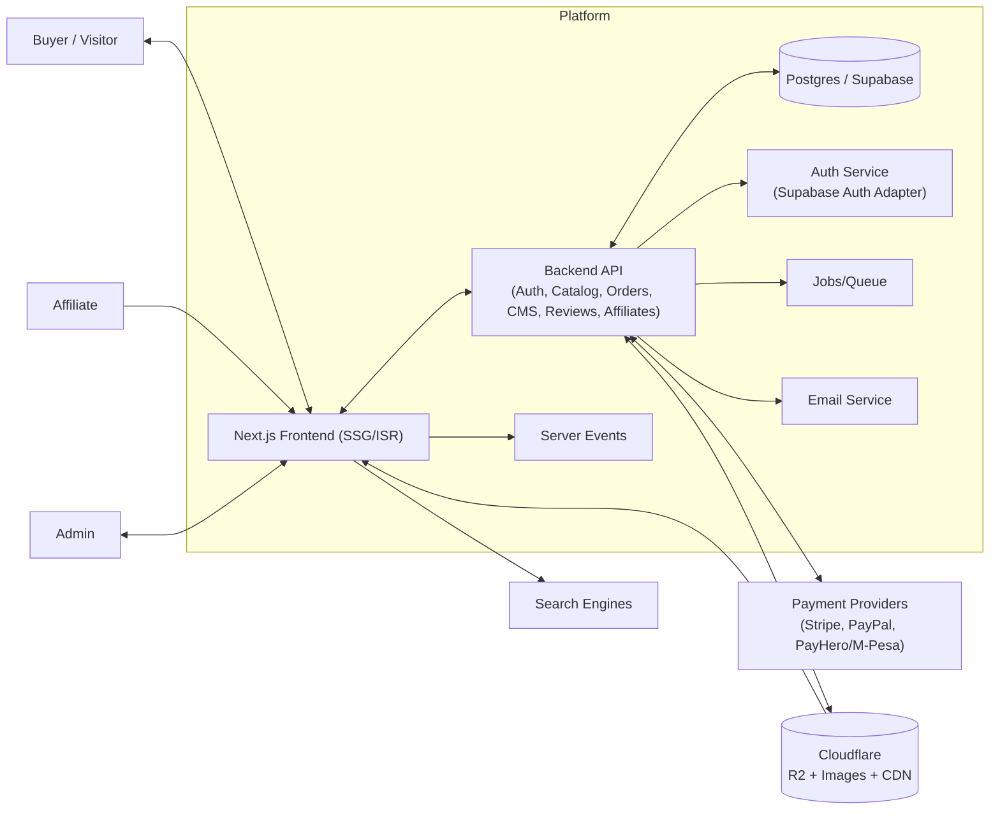
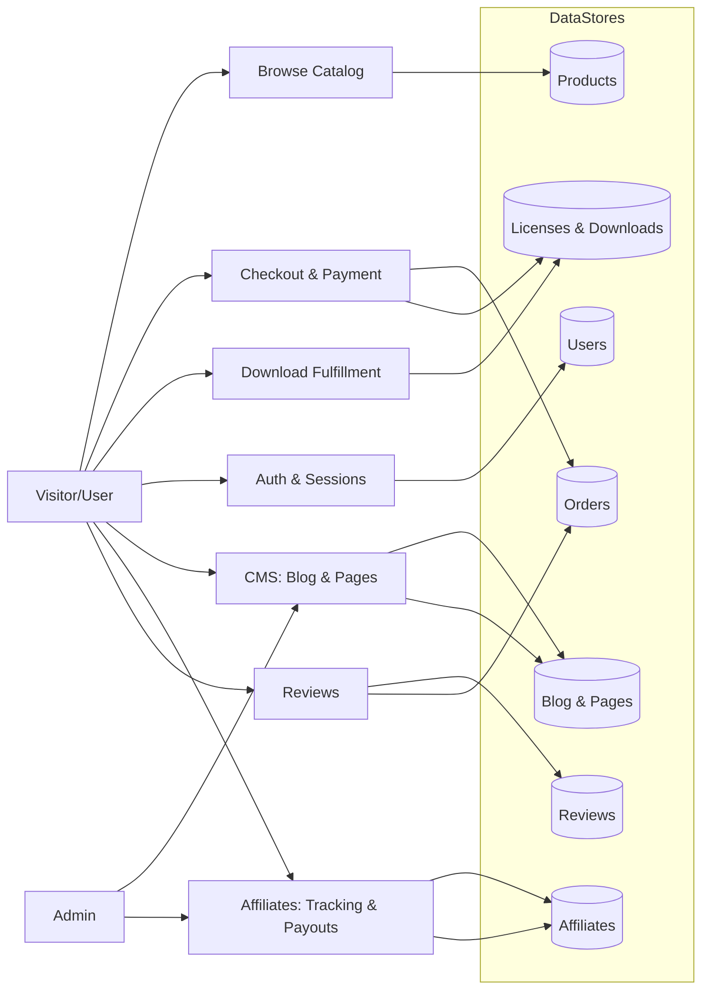
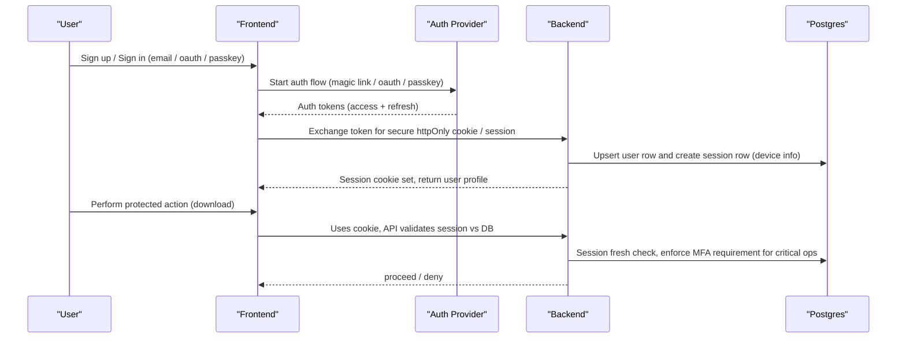
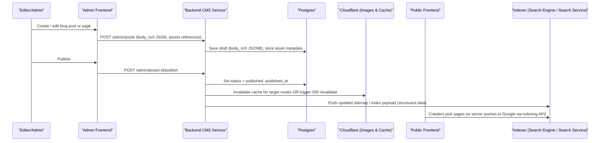
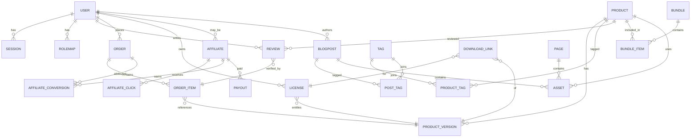
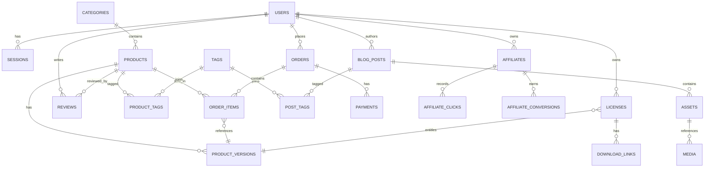
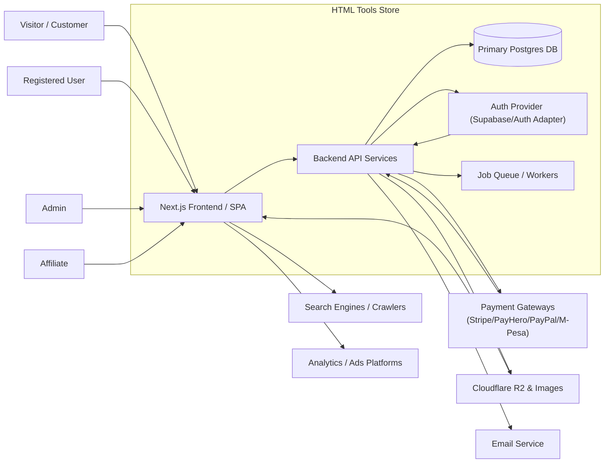
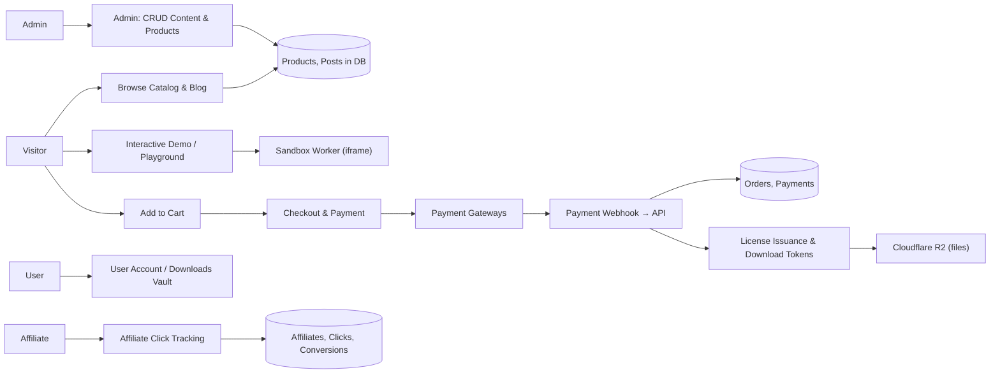
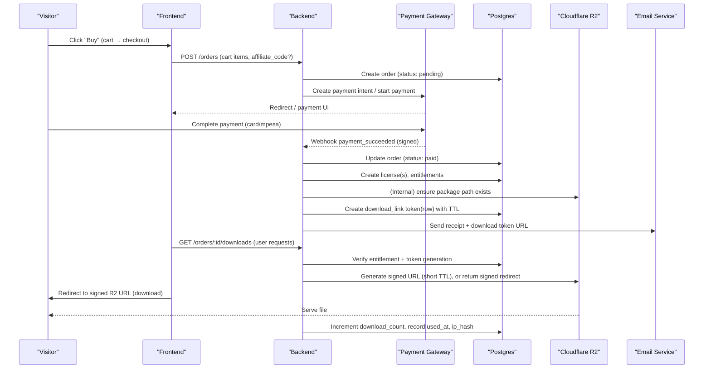

# Comprehensive System Design Document
## HTML Tools Store - No-Regrets Edition

### Table of Contents
1. [Executive Summary](#executive-summary)
2. [System Architecture Overview](#system-architecture-overview)
3. [Data Flow Diagrams](#data-flow-diagrams)
4. [Entity Relationship Diagram](#entity-relationship-diagram)
5. [Database Schema Design](#database-schema-design)
6. [Technology Stack](#technology-stack)
7. [API Design](#api-design)
8. [Security & Privacy](#security--privacy)
9. [Phase 3 — Project Plan, Roadmap & Delivery Playbook](#phase-3--project-plan-roadmap--delivery-playbook)
10. [Operational Guidelines](#operational-guidelines)
11. [Appendices](#appendices)

---

## Executive Summary

This document provides a comprehensive system design for a modern HTML tools and UI components marketplace. The system is architected with a "no-regrets" philosophy, ensuring scalability, maintainability, and future-proofing while maintaining high performance and SEO optimization.

**Key Features:**
- Digital product marketplace for HTML/CSS/JS tools and components
- Affiliate marketing system with commission tracking
- Interactive demos and playgrounds
- Content Management System for blogs and landing pages
- Secure licensing and download management
- Multi-payment gateway support (Stripe, PayPal, M-Pesa via PayHero)
- Modern, responsive UI with accessibility features

---

## System Architecture Overview

### Context Diagram (Level 0)



#### Context Notes
- Users (Customers, Affiliates, Admins) interact with the Web Application.
- Web App communicates with Backend API.
- Backend API interacts with:
  - Supabase (Database & Auth)
  - Cloudflare (Images & File Storage)
  - Payment Providers (PayHero, MPESA)
  - Email Service (Nodemailer/Transactional)
  - CMS Module for blog and static page content.

### System Components

#### Frontend Stack
- **Framework**: Next.js with App Router for SEO and performance
- **UI Library**: React with ShadCN UI components
- **Styling**: Tailwind CSS with design tokens
- **State Management**: React Query / TanStack Query
- **Forms**: React Hook Form with Zod validation
- **Animations**: Framer Motion
- **Icons**: Lucide React

#### Backend Stack
- **Runtime**: Node.js with Express or Fastify
- **Database**: Supabase (PostgreSQL) with real-time subscriptions
- **Authentication**: Supabase Auth with JWT and refresh tokens
- **File Storage**: Cloudflare R2 for packages and assets
- **Image Optimization**: Cloudflare Images
- **Queue System**: Background job processing

#### Third-Party Integrations
- **Payments**: Stripe, PayPal, PayHero (M-Pesa)
- **Email**: Nodemailer or transactional email service
- **CDN**: Cloudflare for global content delivery
- **Analytics**: Server-side event tracking

---

## Data Flow Diagrams

### Level 1 — Major Processes



#### Detailed Flows

- Authentication Flow
  - User requests login/signup → Auth API → Supabase Auth.
  - Supabase returns JWT token → stored in secure HTTP-only cookies.
- Product Management Flow
  - Admin creates/updates products via Admin Panel → Backend API → Supabase DB.
  - Images uploaded → Cloudflare Storage → URLs stored in DB.
- Affiliate Tracking Flow
  - Affiliate shares referral link → Visitor lands on site → Cookie set.
  - Purchase made → Referral data checked → Commission logged in DB.
- CMS Flow (Blogs, Pages)
  - Admin creates blog/page → Content saved in Supabase CMS table.
  - Images stored in Cloudflare, linked in content.
- Payment Flow
  - User checks out → Payment API → PayHero/MPESA.
  - Confirmation → Order stored in DB → Email receipt sent.

### Level 2 — Critical Path: Checkout & Payment Flow


### Level 2 — Authentication & Session Security



### Level 2 — CMS Publishing Flow



### System-wide Dataflow Summary

**Discovery → Conversion Path:**
1. Visitor lands (SEO page / blog / product PDP)
2. Frontend fetches product & demo assets
3. Visitor interacts with demo (sandboxed iframe)
4. Visitor adds to cart → checkout starts
5. Order created (pending) → payment provider (checkout/intent)
6. Webhook confirms payment → commerce service marks order paid
7. License & entitlements created → download link minted (signed R2 URL)
8. User downloads → analytics events recorded

**Auth Flows:**
- Sign up/in (OAuth/magic link/passkey) handled by Auth Service
- Session cookie issued → identity mapped to users and identities
- Session recorded in sessions table
- Device & security changes update sessions or device table
- Server enforces RBAC by reading role_map and ABAC attributes

**CMS Flows:**
- Editor creates draft post/page → media uploaded to Cloudflare Images
- Assets entry created → publish triggers ISR revalidation and CDN cache purge
- Sitemap updated → programmatic landing pages regenerated (if any)
- Inbound traffic served from edge cache

**Affiliate Flows:**
- Click captured via redirect endpoint → affiliate_clicks row + cookie set
- Order creation reads cookie and assigns affiliate_id to orders
- On payment success affiliate_conversions created
- Admin triggers payout cadence; payouts stored in payouts table

**Review Verification:**
- Review posted → review_proofs links to order_item to mark as verified
- Moderation queue enforced; approved reviews surface on PDP and affect rating_cache and rating_count on products

**Background Tasks:**
- Email sending, webhook reconciliation, affiliate payout generation, analytics aggregation, and sitemap regeneration run on worker queue (outbox pattern) to decouple synchronous requests

### Primary Entity Relationship Highlights (Detailed)

- **users → orders** is 1-to-many; **orders → order_items** 1-to-many; **order_items → product_versions** many-to-1
- **product_versions** are the canonical deliverable artifact (zip in R2); **licenses** point to product_versions (entitlement), **download_links** point to both license and product_version
- **products** aggregate product_versions, assets, tags, and reviews (ratings cached on products)
- **blog_posts** and **pages** reuse assets for media; blog_posts connect to products via internal shortcodes/CTAs for conversion tracking
- **affiliates** tie to users (one-to-one) and to affiliate_clicks/commissions. Commissions derived from orders at payment_succeeded event
- **bundles** aggregate multiple products with special pricing; order_items can reference either product_versions or bundles

### Schema Guardrails (No-Regrets)

- Use UUID PKs everywhere and avoid natural keys as primary
- Prefer narrow, focused tables over huge JSON blobs (except body_rich for CMS where JSON is intentional)
- Add version/schema_version on rich content for safe migrations
- Write migration scripts to backfill license and download_link for historical orders during schema changes
- Enforce foreign keys and selective ON DELETE semantics (usually RESTRICT for orders/licenses; CASCADE only where safe, e.g., product_tags entries when product deleted)

---

### ERD — Core Entities (Exact fields)

1. Users - user_id (PK) - name, email, password_hash - role (admin, affiliate, customer) - created_at, updated_at
2. Products - product_id (PK) - title, description, price, image_url - created_by (FK: Users) - created_at, updated_at
3. Orders - order_id (PK) - user_id (FK: Users) - product_id (FK: Products) - total_amount, payment_status - affiliate_id (FK: Affiliates) - created_at
4. Affiliates - affiliate_id (PK) - user_id (FK: Users) - referral_code, commission_rate
5. Commissions - commission_id (PK) - affiliate_id (FK: Affiliates) - order_id (FK: Orders) - amount, status
6. CMS Pages - page_id (PK) - slug, title, content_html, content_json - created_by (FK: Users)
7. Blog Posts - blog_id (PK) - title, slug, content_html, content_json - created_by (FK: Users) - created_at

## Entity Relationship Diagram



Alternate ERD (additional view)


### Relational Formal Definition (RFD) — Concrete Tables & Notes (verbatim)
Use these definitions as a starting SQL schema. I provide columns, PK/FK, constraints and recommended indexes. Where appropriate I add operational notes (TTL, indices, unique constraints).

Convention: id UUID PRIMARY KEY, timestamps (created_at TIMESTAMPTZ DEFAULT now(), updated_at TIMESTAMPTZ). Use soft delete via deleted_at TIMESTAMPTZ NULL if needed.

1. Auth & Users
users
id UUID PRIMARY KEY
email TEXT UNIQUE NOT NULL
display_name TEXT
is_email_verified BOOLEAN DEFAULT FALSE
preferred_locale TEXT NULL
created_at TIMESTAMPTZ DEFAULT now()
updated_at TIMESTAMPTZ DEFAULT now()
metadata JSONB NULL — (profile extras)
Indexes: CREATE INDEX idx_users_email ON users(email);

identities
id UUID PRIMARY KEY
user_id UUID REFERENCES users(id) ON DELETE CASCADE
provider TEXT NOT NULL — ('supabase','google','github','passkey')
provider_subject TEXT NOT NULL
created_at TIMESTAMPTZ DEFAULT now()
UNIQUE(user_id, provider, provider_subject)

sessions
id UUID PRIMARY KEY
user_id UUID REFERENCES users(id) ON DELETE CASCADE
session_token_hash TEXT NOT NULL — store hash of token
device_info JSONB NULL — user agent, device name
ip_hash TEXT — hashed IP for privacy
mfa_level TEXT DEFAULT 'none'
created_at TIMESTAMPTZ DEFAULT now()
last_seen_at TIMESTAMPTZ
expires_at TIMESTAMPTZ
revoked_at TIMESTAMPTZ NULL
Indexes: idx_sessions_userid (user_id), idx_sessions_revoked (revoked_at)

Notes: Rotate refresh tokens, hash tokens (do not store raw refresh tokens).

2. Catalog (Products / Versions / Tags / Categories)
categories
id UUID PRIMARY KEY
slug TEXT UNIQUE NOT NULL
name TEXT NOT NULL
description TEXT
parent_id UUID NULL REFERENCES categories(id)
created_at, updated_at

products
id UUID PRIMARY KEY
slug TEXT UNIQUE NOT NULL
sku TEXT UNIQUE
title TEXT NOT NULL
subtitle TEXT NULL
description_md TEXT
price_cents INT NOT NULL
currency TEXT NOT NULL — e.g. 'USD', 'KES'
category_id UUID REFERENCES categories(id) NULL
cover_image_id UUID NULL — references assets.id
is_active BOOLEAN DEFAULT TRUE
rating_cache NUMERIC DEFAULT 0.0
rating_count INT DEFAULT 0
created_at, updated_at
Indexes: idx_products_slug (slug), full-text index on (title, subtitle, description_md).

product_versions
id UUID PRIMARY KEY
product_id UUID REFERENCES products(id) ON DELETE CASCADE
version_semver TEXT NOT NULL
r2_key_package TEXT NOT NULL — products/{product_id}/{version}/package.zip
changelog_md TEXT
is_latest BOOLEAN DEFAULT FALSE
created_at TIMESTAMPTZ DEFAULT now()
UNIQUE(product_id, version_semver)

tags
id UUID PRIMARY KEY
slug TEXT UNIQUE NOT NULL
label TEXT NOT NULL

product_tags
product_id UUID REFERENCES products(id) ON DELETE CASCADE
tag_id UUID REFERENCES tags(id) ON DELETE CASCADE
PRIMARY KEY(product_id, tag_id)

assets
id UUID PRIMARY KEY
owner_type TEXT — ('product','post','page','user_avatar','og_image')
owner_id UUID NULL
r2_key TEXT NULL
cf_image_id TEXT NULL — cloudflare image id
url TEXT — cached public URL pattern
alt_text TEXT
mime TEXT
size INT
created_at TIMESTAMPTZ
Index: idx_assets_owner (owner_type, owner_id)

3. Orders, Payments, Licenses, Downloads
orders
id UUID PRIMARY KEY
user_id UUID NULL REFERENCES users(id)
status TEXT NOT NULL — ('pending','paid','failed','refunded','cancelled')
subtotal_cents INT NOT NULL
discount_cents INT DEFAULT 0
tax_cents INT DEFAULT 0
total_cents INT NOT NULL
currency TEXT NOT NULL
affiliate_id UUID NULL REFERENCES affiliates(id)
metadata JSONB NULL — includes IP, UA, coupon, presentment info
created_at TIMESTAMPTZ DEFAULT now()
paid_at TIMESTAMPTZ NULL
Indexes: idx_orders_userid_created (user_id, created_at), idx_orders_status (status)

order_items
id UUID PRIMARY KEY
order_id UUID REFERENCES orders(id) ON DELETE CASCADE
product_id UUID REFERENCES products(id)
product_version_id UUID REFERENCES product_versions(id)
unit_price_cents INT
quantity INT DEFAULT 1
created_at TIMESTAMPTZ

payments
id UUID PRIMARY KEY
order_id UUID REFERENCES orders(id) ON DELETE CASCADE
provider TEXT NOT NULL — ('stripe','paypal','payhero')
provider_payment_id TEXT — unique provider txn id
amount_cents INT
currency TEXT
status TEXT — ('pending','succeeded','failed')
raw_payload JSONB — webhook payload for reconciliation
created_at TIMESTAMPTZ DEFAULT now()
Unique: (provider, provider_payment_id)

licenses
id UUID PRIMARY KEY
user_id UUID REFERENCES users(id) ON DELETE CASCADE
product_version_id UUID REFERENCES product_versions(id) ON DELETE CASCADE
license_key TEXT UNIQUE — generated, included in package
license_type TEXT — ('personal','team','commercial')
is_active BOOLEAN DEFAULT TRUE
issued_at TIMESTAMPTZ DEFAULT now()
revoked_at TIMESTAMPTZ NULL
Index: idx_licenses_user (user_id)

download_links
id UUID PRIMARY KEY
license_id UUID REFERENCES licenses(id) ON DELETE CASCADE
product_version_id UUID REFERENCES product_versions(id)
token TEXT UNIQUE NOT NULL — short random token stored hashed preferably
expires_at TIMESTAMPTZ NOT NULL
max_uses INT DEFAULT 5
uses_count INT DEFAULT 0
last_used_at TIMESTAMPTZ NULL
created_at TIMESTAMPTZ DEFAULT now()
Indexes: idx_downloads_expires(expires_at), idx_downloads_token(token)

Operational notes:
Tokens are single-purpose; when user requests a download, backend mints a signed R2 URL of short TTL (<= 5 min) and returns it or redirects.
Track IP hash, increment uses_count and set last_used_at.

4. Reviews & Ratings
reviews
id UUID PRIMARY KEY
user_id UUID REFERENCES users(id)
product_id UUID REFERENCES products(id)
rating INT CHECK (rating BETWEEN 1 AND 5)
body_md TEXT
status TEXT DEFAULT 'pending' — ('pending','approved','rejected')
created_at TIMESTAMPTZ
updated_at TIMESTAMPTZ
Index: idx_reviews_product_status (product_id, status)

review_proofs
id UUID PRIMARY KEY
review_id UUID REFERENCES reviews(id) ON DELETE CASCADE
order_item_id UUID REFERENCES order_items(id) — proof of purchase
Constraint: ensure proof order_item references product_id == review.product_id

5. Affiliates & Referral Tracking
affiliates
id UUID PRIMARY KEY
user_id UUID REFERENCES users(id) UNIQUE — optional owner
code TEXT UNIQUE NOT NULL — short referral code
display_name TEXT
status TEXT — ('pending','approved','blocked')
commission_bps INT DEFAULT 1000 — 1000 = 10.00%
created_at TIMESTAMPTZ

affiliate_clicks
id UUID PRIMARY KEY
affiliate_id UUID REFERENCES affiliates(id)
click_ts TIMESTAMPTZ DEFAULT now()
landing_url TEXT
ip_hash TEXT
user_agent TEXT
utm_params JSONB NULL
Index: idx_affclicks_affiliate_ts (affiliate_id, click_ts)

affiliate_conversions
id UUID PRIMARY KEY
affiliate_id UUID REFERENCES affiliates(id)
order_id UUID REFERENCES orders(id) UNIQUE
commission_cents INT
created_at TIMESTAMPTZ DEFAULT now()
Note: Orders should reference affiliate (orders.affiliate_id) for direct attribution as well.

payouts
id UUID PRIMARY KEY
affiliate_id UUID REFERENCES affiliates(id)
amount_cents INT
currency TEXT
status TEXT — ('pending','paid','failed')
requested_at TIMESTAMPTZ
paid_at TIMESTAMPTZ NULL
Index: idx_payouts_affiliate (affiliate_id)

Operational: cookie window default 24 hours (configurable). When a landing happens with ?aff=CODE, record click and set first-party cookie with timestamp. On checkout, resolve affiliate via cookie (last click inside window) or explicit code.

6. CMS — Blog & Pages
blog_posts
id UUID PRIMARY KEY
slug TEXT UNIQUE NOT NULL
title TEXT NOT NULL
excerpt TEXT
body_json JSONB NOT NULL — portable rich text schema (blocks, code blocks)
author_id UUID REFERENCES users(id)
status TEXT — ('draft','scheduled','published')
published_at TIMESTAMPTZ NULL
og_image_id UUID NULL REFERENCES assets(id)
seo_title TEXT
seo_description TEXT
created_at, updated_at

post_tags
post_id UUID REFERENCES blog_posts(id)
tag_id UUID REFERENCES tags(id)
PRIMARY KEY(post_id, tag_id)

pages
id UUID PRIMARY KEY
slug TEXT UNIQUE
title TEXT
body_json JSONB
status TEXT
published_at TIMESTAMPTZ
created_at, updated_at

media_registry (assets table earlier covers this) — stores R2 keys & image variants
Notes:
On publish: API triggers ISR revalidate for Next.js page and invalidates CDN cache. Push to sitemap generator and optional search index (Typesense/Algolia/Meilisearch) or trigger incremental indexing.

7. Analytics & Tracking (Lightweight event store)
events (optional)
id UUID
user_id UUID NULL
event_type TEXT — e.g. page_view, product_view, checkout_start, purchase_complete
payload JSONB
created_at TIMESTAMPTZ
Retention: roll up to analytics DB or purge after 90 days if only used for aggregate metrics.
Alternatively stream events to a data warehouse (Supabase + ETL to BigQuery/Clickhouse) for long-term analysis.

8. Admin & Operational Tables
feature_flags
key TEXT PRIMARY KEY
value JSONB
updated_at TIMESTAMPTZ

redirects
id UUID PRIMARY KEY
from_path TEXT UNIQUE
to_url TEXT
status_code INT DEFAULT 301
created_at

audit_log
id UUID PRIMARY KEY
actor_user_id UUID NULL
action TEXT
target_type TEXT
target_id UUID NULL
meta JSONB
created_at TIMESTAMPTZ DEFAULT now()


### Primary Entity Relationship Highlights

- **users → orders** is 1-to-many; **orders → order_items** 1-to-many; **order_items → product_versions** many-to-1
- **product_versions** are the canonical deliverable artifact (zip in R2); **licenses** point to product_versions (entitlement)
- **download_links** point to both license and product_version
- **products** aggregate product_versions, assets, tags, and reviews (ratings cached on products)
- **blog_posts** and **pages** reuse assets for media; blog_posts connect to products via internal shortcodes/CTAs
- **affiliates** tie to users (one-to-one) and to affiliate_clicks/affiliate_conversions
- Commissions derived from orders at payment_succeeded event

---

## Database Schema Design

### Conventions
- **Primary Keys**: UUID everywhere
- **Timestamps**: `created_at`, `updated_at` (timestamptz defaults)
- **Soft Delete**: `deleted_at` where noted
- **Foreign Keys**: Enforced with selective ON DELETE semantics
- **Indexes**: Important indexes noted with `-- idx`

### Schema Guardrails
- Use UUID PKs everywhere and avoid natural keys as primary
- Prefer narrow, focused tables over huge JSON blobs (except body_rich for CMS)
- Add version/schema_version on rich content for safe migrations
- Write migration scripts to backfill license and download_link for historical orders
- Enforce foreign keys and selective ON DELETE semantics (usually RESTRICT for orders/licenses; CASCADE only where safe)

### Core Tables

#### 1. Users & Authentication

```sql
-- Core Entity 1: Users (as specified in instructions)
users(
    user_id UUID PRIMARY KEY,
    name TEXT NOT NULL,
    email TEXT UNIQUE NOT NULL,
    password_hash TEXT NOT NULL,
    role ENUM('admin','affiliate','customer') DEFAULT 'customer',
    created_at TIMESTAMPTZ DEFAULT now(),
    updated_at TIMESTAMPTZ DEFAULT now()
);
-- idx(email)

-- Identity providers mapping
identities(
    id UUID PRIMARY KEY,
    user_id UUID REFERENCES users(id) ON DELETE CASCADE,
    provider ENUM('supabase','google','github','passkey'),
    provider_subject TEXT NOT NULL,
    created_at TIMESTAMPTZ DEFAULT now(),
    UNIQUE(user_id, provider)
);

-- Session management
sessions(
    id UUID PRIMARY KEY,
    user_id UUID REFERENCES users(id) ON DELETE CASCADE,
    session_token_hash TEXT NOT NULL,
    device_info JSONB NULL,
    ip_hash TEXT,
    mfa_level ENUM('none','totp','passkey') DEFAULT 'none',
    created_at TIMESTAMPTZ DEFAULT now(),
    last_seen_at TIMESTAMPTZ,
    expires_at TIMESTAMPTZ,
    revoked_at TIMESTAMPTZ NULL
);
-- idx(user_id), idx(revoked_at)

-- Role-based access control
role_map(
    user_id UUID REFERENCES users(id),
    role ENUM('user','affiliate','admin'),
    PRIMARY KEY(user_id, role)
);
```

#### 2. Product Catalog

```sql
-- Product categories (hierarchical)
categories(
    id UUID PRIMARY KEY,
    slug TEXT UNIQUE NOT NULL,
    name TEXT NOT NULL,
    description TEXT,
    parent_id UUID NULL REFERENCES categories(id),
    sort_order INT DEFAULT 0,
    is_active BOOLEAN DEFAULT TRUE,
    created_at TIMESTAMPTZ DEFAULT now(),
    updated_at TIMESTAMPTZ DEFAULT now()
);
-- idx(parent_id, sort_order), idx(slug)

-- Core Entity 2: Products (as specified in instructions)
products(
    product_id UUID PRIMARY KEY,
    title TEXT NOT NULL,
    description TEXT,
    price DECIMAL(10,2) NOT NULL,
    image_url TEXT,
    created_by UUID REFERENCES users(user_id),
    created_at TIMESTAMPTZ DEFAULT now(),
    updated_at TIMESTAMPTZ DEFAULT now()
);
-- idx(created_by), full-text index on (title, description)

-- Product versions (deliverable artifacts)
product_versions(
    id UUID PRIMARY KEY,
    product_id UUID REFERENCES products(id) ON DELETE CASCADE,
    version_semver TEXT NOT NULL,
    changelog_md TEXT,
    r2_key_zip TEXT NOT NULL, -- products/{product_id}/{version}/package.zip
    license_template_id UUID,
    is_latest BOOLEAN DEFAULT FALSE,
    created_at TIMESTAMPTZ DEFAULT now(),
    UNIQUE(product_id, version_semver)
);

-- Tags for categorization
tags(
    id UUID PRIMARY KEY,
    slug TEXT UNIQUE NOT NULL,
    label TEXT NOT NULL
);

-- Product-tag relationships
product_tags(
    product_id UUID REFERENCES products(id) ON DELETE CASCADE,
    tag_id UUID REFERENCES tags(id) ON DELETE CASCADE,
    PRIMARY KEY(product_id, tag_id)
);

-- Product bundles
bundles(
    id UUID PRIMARY KEY,
    slug TEXT UNIQUE NOT NULL,
    title TEXT NOT NULL,
    description_md TEXT,
    price_cents INT NOT NULL,
    currency TEXT NOT NULL DEFAULT 'USD',
    is_active BOOLEAN DEFAULT TRUE,
    created_at TIMESTAMPTZ DEFAULT now(),
    updated_at TIMESTAMPTZ DEFAULT now()
);

-- Bundle-product relationships
bundle_items(
    bundle_id UUID REFERENCES bundles(id) ON DELETE CASCADE,
    product_id UUID REFERENCES products(id) ON DELETE CASCADE,
    PRIMARY KEY(bundle_id, product_id)
);

-- Asset management
assets(
    id UUID PRIMARY KEY,
    owner_type ENUM('product','blogpost','page','user_avatar'),
    owner_id UUID,
    r2_key TEXT,
    cf_image_id TEXT, -- Cloudflare image ID
    url TEXT, -- cached public URL
    alt_text TEXT,
    mime_type TEXT,
    file_size INT,
    created_at TIMESTAMPTZ DEFAULT now()
);
-- idx(owner_type, owner_id)
```

#### 3. Orders & Commerce

```sql
-- Core Entity 3: Orders (as specified in instructions)
orders(
    order_id UUID PRIMARY KEY,
    user_id UUID REFERENCES users(user_id),
    product_id UUID REFERENCES products(product_id),
    total_amount DECIMAL(10,2) NOT NULL,
    payment_status ENUM('pending','paid','failed','refunded') DEFAULT 'pending',
    affiliate_id UUID NULL REFERENCES affiliates(affiliate_id),
    created_at TIMESTAMPTZ DEFAULT now()
);
-- idx(user_id), idx(affiliate_id)

-- Order line items
order_items(
    id UUID PRIMARY KEY,
    order_id UUID REFERENCES orders(id) ON DELETE CASCADE,
    product_id UUID REFERENCES products(id),
    product_version_id UUID REFERENCES product_versions(id),
    item_type ENUM('product','bundle'),
    unit_price_cents INT,
    quantity INT DEFAULT 1,
    created_at TIMESTAMPTZ DEFAULT now()
);

-- Payment tracking
payments(
    id UUID PRIMARY KEY,
    order_id UUID REFERENCES orders(id) ON DELETE CASCADE,
    provider ENUM('stripe','paypal','payhero') NOT NULL,
    provider_payment_id TEXT,
    amount_cents INT,
    currency TEXT,
    status ENUM('pending','succeeded','failed'),
    raw_payload JSONB, -- webhook payload for reconciliation
    created_at TIMESTAMPTZ DEFAULT now(),
    UNIQUE(provider, provider_payment_id)
);
```

#### 4. Licensing & Downloads

```sql
-- User licenses (entitlements)
licenses(
    id UUID PRIMARY KEY,
    user_id UUID REFERENCES users(id) ON DELETE CASCADE,
    product_version_id UUID REFERENCES product_versions(id) ON DELETE CASCADE,
    license_key TEXT UNIQUE,
    license_type ENUM('personal','team','commercial'),
    is_active BOOLEAN DEFAULT TRUE,
    issued_at TIMESTAMPTZ DEFAULT now(),
    revoked_at TIMESTAMPTZ NULL
);
-- idx(user_id)

-- Secure download links
download_links(
    id UUID PRIMARY KEY,
    license_id UUID REFERENCES licenses(id) ON DELETE CASCADE,
    product_version_id UUID REFERENCES product_versions(id),
    token TEXT UNIQUE NOT NULL,
    expires_at TIMESTAMPTZ NOT NULL,
    max_uses INT DEFAULT 5,
    uses_count INT DEFAULT 0,
    last_used_at TIMESTAMPTZ NULL,
    ip_hash TEXT,
    created_at TIMESTAMPTZ DEFAULT now()
);
-- idx(license_id, expires_at), idx(token)
```

#### 5. Reviews & Ratings

```sql
-- Product reviews
reviews(
    id UUID PRIMARY KEY,
    user_id UUID REFERENCES users(id),
    product_id UUID REFERENCES products(id),
    rating INT CHECK(rating BETWEEN 1 AND 5),
    body_md TEXT,
    status ENUM('pending','approved','rejected') DEFAULT 'pending',
    created_at TIMESTAMPTZ DEFAULT now(),
    updated_at TIMESTAMPTZ DEFAULT now()
);
-- idx(product_id, status)

-- Purchase verification for reviews
review_proofs(
    id UUID PRIMARY KEY,
    review_id UUID REFERENCES reviews(id) ON DELETE CASCADE,
    order_item_id UUID REFERENCES order_items(id)
);
```

#### 6. Affiliate System

```sql
-- Core Entity 4: Affiliates (as specified in instructions)
affiliates(
    affiliate_id UUID PRIMARY KEY,
    user_id UUID REFERENCES users(user_id) UNIQUE,
    referral_code TEXT UNIQUE NOT NULL,
    commission_rate DECIMAL(5,2) DEFAULT 10.00, -- percentage
    created_at TIMESTAMPTZ DEFAULT now()
);

-- Click tracking
affiliate_clicks(
    id UUID PRIMARY KEY,
    affiliate_id UUID REFERENCES affiliates(id),
    click_ts TIMESTAMPTZ DEFAULT now(),
    landing_url TEXT,
    ip_hash TEXT,
    user_agent TEXT,
    utm_params JSONB NULL
);
-- idx(affiliate_id, click_ts)

-- Affiliate conversions (tracking)
affiliate_conversions(
    id UUID PRIMARY KEY,
    affiliate_id UUID REFERENCES affiliates(id),
    order_id UUID REFERENCES orders(id) UNIQUE,
    commission_cents INT,
    created_at TIMESTAMPTZ DEFAULT now()
);

-- Core Entity 5: Commissions (as specified in instructions)
commissions(
    commission_id UUID PRIMARY KEY,
    affiliate_id UUID REFERENCES affiliates(affiliate_id),
    order_id UUID REFERENCES orders(order_id),
    amount DECIMAL(10,2) NOT NULL,
    status ENUM('pending','approved','paid') DEFAULT 'pending',
    created_at TIMESTAMPTZ DEFAULT now()
);

-- Payout management
payouts(
    id UUID PRIMARY KEY,
    affiliate_id UUID REFERENCES affiliates(id),
    amount_cents INT,
    currency TEXT,
    status ENUM('pending','paid','failed'),
    requested_at TIMESTAMPTZ DEFAULT now(),
    paid_at TIMESTAMPTZ NULL,
    notes TEXT
);
-- idx(affiliate_id)
```

#### 7. Content Management System

```sql
-- Core Entity 6: CMS Pages (as specified in instructions)
cms_pages(
    page_id UUID PRIMARY KEY,
    slug TEXT UNIQUE NOT NULL,
    title TEXT NOT NULL,
    content_html TEXT,
    content_json JSONB,
    created_by UUID REFERENCES users(user_id),
    created_at TIMESTAMPTZ DEFAULT now()
);

-- Core Entity 7: Blog Posts (as specified in instructions)
blog_posts(
    blog_id UUID PRIMARY KEY,
    title TEXT NOT NULL,
    slug TEXT UNIQUE NOT NULL,
    content_html TEXT,
    content_json JSONB,
    created_by UUID REFERENCES users(user_id),
    created_at TIMESTAMPTZ DEFAULT now()
);
```

#### 8. System Administration

```sql
-- Feature flags
feature_flags(
    key TEXT PRIMARY KEY,
    value JSONB,
    updated_at TIMESTAMPTZ DEFAULT now()
);

-- URL redirects
redirects(
    id UUID PRIMARY KEY,
    from_path TEXT UNIQUE,
    to_url TEXT,
    status_code INT DEFAULT 301,
    created_at TIMESTAMPTZ DEFAULT now()
);

-- Audit logging
audit_log(
    id UUID PRIMARY KEY,
    actor_user_id UUID REFERENCES users(id),
    action TEXT,
    target_type TEXT,
    target_id UUID,
    meta JSONB,
    created_at TIMESTAMPTZ DEFAULT now()
);

-- Analytics events tracking
events(
    id UUID PRIMARY KEY,
    user_id UUID NULL REFERENCES users(id),
    event_type TEXT NOT NULL, -- e.g. page_view, product_view, checkout_start, purchase_complete
    payload JSONB,
    ip_hash TEXT,
    user_agent TEXT,
    created_at TIMESTAMPTZ DEFAULT now()
);
-- idx(event_type, created_at), idx(user_id, created_at)
```

---

### Relational Formal Definition (RFD) — Concrete Tables & Notes
Use these definitions as a starting SQL schema. Columns, PK/FK, constraints and recommended indexes are captured. Where appropriate, operational notes (TTL, indices, unique constraints) are included.

Convention: id UUID PRIMARY KEY, timestamps (created_at TIMESTAMPTZ DEFAULT now(), updated_at TIMESTAMPTZ). Use soft delete via deleted_at TIMESTAMPTZ NULL if needed.

Auth & Users, Catalog, Orders & Licenses, Reviews, Affiliates, CMS, Admin/Meta are defined in the list above (Core Tables (Exact)).

## Technology Stack

### Frameworks & UI Stack (Quick Reference)

Frontend:
- Next.js (App Router for SEO & speed)
- React (Component-driven architecture)
- ShadCN UI (Modern, accessible, themeable components)
- Tailwind CSS (Utility-first styling)
- Framer Motion (Smooth animations)

Backend:
- Node.js (Express or Fastify)
- Supabase (PostgreSQL DB, Auth)
- WebSockets for real-time updates

Storage:
- Cloudflare R2 for file/image storage

Payments:
- PayHero + MPESA Integration

Auth:
- Supabase Auth or Auth.js with JWT & refresh tokens

### Frontend Frameworks & Design System

#### Tech Stack (Frontend)
- **Framework**: Next.js (latest stable) — SSG/ISR for SEO, edge rendering for personalization
- **UI Library**: React + shadcn/ui for accessible building blocks, augmented with bespoke component library
- **Styling**: Tailwind CSS (utility-first) + design tokens (CSS variables) for theming
- **State & Data**: React Query / TanStack Query for data fetching + SWR for lightweight caches
- **Forms & Validation**: React Hook Form + Zod for validation
- **Animations**: Framer Motion for subtle, modern motion
- **Icons**: lucide-react for crisp, modern icons

#### Component & Design System Strategy
- **Atomic Design**: atoms (button, input), molecules (search bar, product card), organisms (product grid, navbar), templates (PDP layout), pages
- **Component Library**: private package published as npm package consumed by Next.js app
- **Design Tokens**: color palette, spacing, radii, font scale, shadow tokens in JSON + CSS variables
- **Theming**: light/dark by default; theme keys driven by CSS variables and Tailwind config
- **Accessibility**: components include aria attributes, keyboard focus states, high contrast modes
- **Responsive**: mobile-first breakpoint system, fluid typography (clamp)
- **Documentation**: Storybook or custom docs site showcasing components

#### Landing & Conversion UI Patterns
- **Hero**: clear value proposition, single primary CTA (Buy / Try Demo), trust badges
- **Product Card**: screenshot (responsive), 1-line benefit, price, rating, small CTA
- **PDP**: large demo iframe, features list, use cases, license badge, version dropdown, buy widget
- **Checkout**: minimal form fields, express pay buttons, progress indicator, clear refund policy
- **Account**: downloads grid with thumbnails, license keys, re-download button, version changelog
- **Blog**: content with inline CTAs, table of contents, code blocks with copy buttons

#### Visual Language & Microcopy
- Neutral, professional colors with bright accent for CTAs
- Friction-reducing microcopy: "Download instantly", "No setup required", "Works offline"
- Example use cases and one-line snippets showing quick integration
- High-quality screenshots and short GIF demos (3–6s)

#### Performance & SEO Considerations
- Pre-render product and key landing pages (SSG) with incremental revalidation
- Use `<link rel=preload>` for hero images and critical fonts
- Avoid heavy client JS for landing pages — hydrate demos only when visible
- Optimize images via Cloudflare Images (AVIF/WebP variants)
- Implement structured data for Product & Article on server render

### Backend Architecture

#### Framework & Runtime
- **Node.js** with Express or Fastify for lightweight, fast API services
- **Supabase** for PostgreSQL database with real-time subscriptions
- **Supabase Auth** for authentication with JWT and OAuth providers
- **WebSockets** for real-time updates where needed

#### Service Boundaries
- **Auth Service**: abstracts Supabase/Auth0, handles sessions, MFA, passkeys, device registry
- **Catalog Service**: products, versions, tags, search functionality
- **Commerce Service**: cart, orders, taxes, payments, webhooks, entitlements/licensing
- **Download Service**: R2 signed URLs, rate limiting, link watermarking
- **CMS Service**: posts, pages, media assets, publishing cache invalidation
- **Review Service**: CRUD + moderation + aggregation cache
- **Affiliate Service**: code issuance, click tracking, attribution, payouts
- **Admin/Reporting Service**: KPIs, exports, audit log

### Storage & CDN
- **Cloudflare R2**: primary file storage for product packages and assets
- **Cloudflare Images**: optimized image delivery with automatic format conversion
- **Cloudflare CDN**: global content delivery and caching

### Payment Integration
- **Stripe**: primary payment processor for global markets
- **PayPal**: alternative payment method
- **PayHero**: M-Pesa integration for Kenya market
- **Webhook Security**: signature verification and idempotency handling

### Frontend Design System & Modern UI Guidelines

This section prescribes the exact frontend stack, component strategy, and design system rules so the store looks modern, polished, and sells your assets — especially important since you sell UI content.

#### Component & Design System Strategy

- **Atomic Design**: atoms (button, input), molecules (search bar, product card), organisms (product grid, navbar), templates (PDP layout), pages
- **Component Library**: private package published as npm package consumed by Next.js app and any marketing microsites. Include variants for Tailwind and plain CSS
- **Design Tokens**: color palette, spacing, radii, font scale, shadow tokens in JSON + CSS variables for runtime theming (light/dark)
- **Theming**: light/dark by default; theme keys driven by CSS variables and Tailwind config
- **Accessibility**: components must include aria attributes, keyboard focus states, and high contrast modes
- **Responsive & Mobile First**: breakpoint system in tokens, fluid typography (clamp)
- **Documentation Site**: Storybook or custom docs site showcasing components and usage snippets — this doubles as marketing proof you sell useful UI

#### Landing & Conversion UI Patterns (Must Convert)

- **Hero**: clear value proposition, single primary CTA (Buy / Try Demo), trust badges (payments accepted, refund policy)
- **Product Card**: screenshot (responsive), 1-line benefit, price, rating, small CTA
- **PDP**: large demo iframe, features list, use cases, license badge, version dropdown, buy widget (price + license type), related products, FAQs, verified reviews
- **Checkout**: minimal form fields, express pay buttons (Stripe/PayPal/M-Pesa), progress indicator, clear refund policy link
- **Account**: downloads grid with thumbnails, license keys, re-download button, version changelog
- **Blog**: content with inline CTAs, table of contents, code blocks with copy buttons, and related products panel

#### Visual Language & Microcopy

- Use neutral, professional colors with a bright accent for CTAs
- Microcopy should reduce friction: "Download instantly", "No setup required", "Works offline"
- Show example use cases and one-line snippet to show how quick integration is
- Use high-quality screenshots and short GIF demos to show interaction (3–6s)

#### Performance & SEO Considerations for Frontend

- Pre-render product and key landing pages (SSG) with incremental revalidation
- Use `<link rel=preload>` for hero images and critical fonts
- Avoid heavy client JS for landing pages — hydrate demos only when visible
- Optimize images via Cloudflare Images (AVIF/WebP variants)
- Implement structured data for Product & Article on server render

#### Developer DX & Reusability

- Component stories + tests (visual regression via Chromatic or Percy)
- Linting (ESLint), formatting (Prettier), TypeScript strict mode
- Single source of truth for tokens; build script to export tokens to Tailwind config and CSS variables

---

### Additional DFDs (verbatim)

DFD — Context Diagram (Level 0)


DFD — Level 1 (Major Processes)


DFD — Level 2 (Checkout → Payment → Download — critical path)


## API Design

### REST API Endpoints

#### Authentication
```
POST /auth/session     - Exchange Supabase token → httpOnly cookie
POST /auth/logout      - Revoke session
GET  /me              - Profile + roles + security level
```

#### Catalog
```
GET /products                    - List products with filtering
GET /products/:slug              - Get product details
GET /products/:slug/versions     - List product versions
GET /products/:id/reviews        - Get approved reviews
GET /bundles                     - List available bundles
GET /bundles/:slug               - Get bundle details with included products
```

#### Cart & Orders
```
POST /orders                     - Create pending order
POST /orders/:id/pay            - Start payment process
GET  /orders/:id                - Get order status/details
GET  /orders/:id/downloads      - List entitled downloads with signed links
```

#### Downloads
```
POST /downloads                  - Mint signed URL for license + version
GET  /downloads/:token          - Validate and redirect to R2
```

#### Reviews
```
POST /products/:id/reviews      - Create review (requires verified purchase)
PATCH /reviews/:id              - Admin moderate review
```

#### Affiliates
```
POST /affiliates/apply           - Apply for affiliate program
GET  /affiliates/me             - Dashboard metrics
GET  /affiliates/:code/redirect - Click tracking + redirect to store
```

#### CMS
```
GET /blog                       - List blog posts
GET /blog/:slug                 - Get blog post
GET /pages/:slug                - Get static page
```

Admin CRUD endpoints for posts/pages/assets

#### Admin Endpoints
```
GET /admin/metrics              - Dashboard metrics
GET /admin/sales                - Sales reporting
GET /admin/top-products         - Top selling products
POST /admin/bundles             - Create new bundle
PUT /admin/bundles/:id          - Update bundle
DELETE /admin/bundles/:id       - Delete bundle
POST /admin/bundles/:id/items   - Add products to bundle
DELETE /admin/bundles/:id/items/:product_id - Remove product from bundle
```

#### Payment Webhooks
```
POST /webhooks/stripe           - Stripe webhook handler
POST /webhooks/paypal           - PayPal webhook handler
POST /webhooks/payhero          - PayHero webhook handler
```

### API Conventions
- **Versioning**: Via header `Accept: application/vnd.app.v1+json` or `/v1/..`
- **Idempotency**: Keys on mutating endpoints to prevent duplicate operations
- **Error Format**: RFC7807 compliant error responses
- **Authentication**: Bearer tokens for API access, httpOnly cookies for web sessions
- **Rate Limiting**: Per-endpoint limits with appropriate HTTP status codes

---

## Security & Privacy

### Download Security & R2 Object Design

R2 Keys
products/{product_id}/{version}/package.zip
licenses/{license_id}/license.txt (optional)

*Signed URLs
- **Short TTL**: ≤ 5 minutes for download URLs
- **Rate Limiting**: 5 downloads per license token by default
- **IP Tracking**: Hashed IP addresses for abuse detection
- **Watermarking**: License information embedded in downloaded packages

Affiliate cookie window: default 24 hours; configurable via feature_flag affiliates.cookie_window_hours.

#### License Watermarking
Embed JSON metadata in LICENSE.txt file within zip packages:
```json
{
  "license_key": "unique-license-key",
  "purchaser_name": "Customer Name",
  "purchaser_email": "customer@example.com",
  "order_id": "order-uuid",
  "issued_at": "2024-01-15T10:30:00Z",
  "license_type": "personal"
}
```

### Authentication & Session Security
- **Multi-Factor Authentication**: TOTP and passkey support
- **Session Management**: httpOnly cookies with secure flags
- **Device Tracking**: Register and manage trusted devices
- **Token Rotation**: Automatic refresh token rotation
- **Brute Force Protection**: Rate limiting on auth endpoints

### Content Security Policy
```
default-src 'self';
script-src 'self' 'unsafe-inline' https://js.stripe.com;
style-src 'self' 'unsafe-inline';
img-src 'self' data: https:;
connect-src 'self' https://api.stripe.com;
frame-src 'self' https://js.stripe.com;
frame-ancestors 'none';
```

### Privacy & Compliance
- **Data Minimization**: Store only necessary user data
- **IP Hashing**: Store hashed IP addresses for privacy
- **GDPR Compliance**: Right to access, modify, and delete user data
- **Cookie Consent**: Granular consent for analytics and marketing cookies
- **Data Retention**: 90-day retention for logs, legal retention for orders

---

## Phase 3 — Project Plan, Roadmap & Delivery Playbook
**(No-Regrets Implementation Strategy)**

**Objective**: Turn Phase 1–2 design into an executable plan with milestones, backlog, workflows, QA strategy, CI/CD, and checklists so implementation is predictable and regret-free. Optimized for a small team/solo dev working in iterations.

### 1) Delivery Strategy at a Glance

- **Methodology**: Iterative (2-week sprints or Kanban), milestone-driven
- **Release Cadence**: Ship to Staging continuously; promote to Prod weekly or when release checklist passes
- **Branch Strategy**: `main` (prod), `develop` (staging), feature branches `feat/*`, fix branches `fix/*`, release branches `release/*`. Protect `main` & `develop`
- **Environments**: Dev (local), Staging, Production. Isolated Supabase DBs & Cloudflare R2 buckets per env. Separate analytics & email credentials per env
- **Change Safety**: Feature flags, dark launches, canary releases, and database migrations with backward compatibility

### 2) Milestones & Build Order

#### M0 – Foundations (Weeks 1-2)
**Exit Criteria**: Hello-world deploy to staging; login/logout works; CI pipeline green
- [ ] Repository setup with issue templates and commit hooks
- [ ] Supabase projects and PostgreSQL schemas applied
- [ ] Cloudflare R2/Images buckets and IAM configuration
- [ ] Auth adapter skeleton with session cookies
- [ ] CI/CD pipeline with automated testing

#### M1 – Catalog & CMS Backbone (Weeks 3-4)  
**Exit Criteria**: Public catalog and blog render from DB; admin can create products and blog posts
- [ ] Products, versions, tags endpoints with admin CRUD
- [ ] CMS: posts/pages CRUD with media upload via Cloudflare Images
- [ ] Next.js SSG/ISR for products and blog posts
- [ ] Sitemap and robots.txt generation

#### M2 – Checkout & Payments (Weeks 5-6)
**Exit Criteria**: Full happy-path purchase on staging; webhook retries proven; test orders visible in admin
- [ ] Orders API with Stripe/PayPal/PayHero adapters
- [ ] Webhook handlers with reconciliation and outbox pattern
- [ ] Cart/Buy-Now frontend with receipt emails

#### M3 – Licensing & Downloads (Week 7)
**Exit Criteria**: Buyer downloads package from account; links expire; audit log captures events
- [ ] License issuance and watermarking system
- [ ] Signed R2 URL generation with rate limits
- [ ] Account vault with download history

#### M4 – Reviews & Affiliates (Week 8)
**Exit Criteria**: Reviews show on PDP after approval; affiliate attribution end-to-end proven
- [ ] Verified reviews with moderation workflow
- [ ] Affiliate click tracking and conversion attribution
- [ ] Dashboard and payout administration

#### M5 – Demos & SEO Hardening (Week 9)
**Exit Criteria**: Core Web Vitals in green; demo sandbox secure with CSP/iframe sandbox
- [ ] Live iframe demos and playgrounds
- [ ] Core Web Vitals optimization
- [ ] Structured data implementation

#### M6 – Analytics & Reporting (Week 10)
**Exit Criteria**: Dashboards show last 30 days sales/funnel; UTM tracked to orders
- [ ] Server-side event tracking
- [ ] Sales and funnel dashboards
- [ ] Affiliate reporting interface

#### M7 – Launch Readiness (Week 11)
**Exit Criteria**: Full release checklist passes; production traffic allowed
- [ ] Legal pages and pricing finalization
- [ ] Support workflows and documentation
- [ ] Backup and monitoring systems
- [ ] Production runbooks

#### M8 – Post-Launch Iterations (Week 12+)
**Exit Criteria**: First A/B test concluded; SEO content calendar running
- [ ] A/B testing framework for pricing and landing pages
- [ ] Bundle and discount system
- [ ] Content velocity optimization

### 3) Backlog — Epics → User Stories (with Acceptance Criteria)

#### EPIC A: Auth & Account
**A1**: As a visitor, I can sign up with email/OAuth/passkey.
- **AC**: Email verify + TOTP optional; device listed in account; session cookie httpOnly.

**A2**: As a user, I can see and revoke active sessions.
- **AC**: Revoked session cannot access protected routes (401); audit event stored.

**A3**: As a user, I can manage profile & security (passkey/TOTP).
- **AC**: Security level displayed; backup codes downloadable.

#### EPIC B: Catalog
**B1**: As a visitor, I can browse/search products by tags/category.
- **AC**: Query, category, tag filters work; pagination; 200ms P95 response on Staging.

**B2**: As an admin, I can create product + versions + assets.
- **AC**: Unique slug enforced; version semver validated; preview renders correctly.

**B3**: As a visitor, I can view and purchase bundles.
- **AC**: Bundle pricing displayed; included products listed; bundle purchase creates individual licenses.

#### EPIC C: CMS
**C1**: As an editor, I can write rich posts with images & CTAs.
- **AC**: Draft → publish workflow; OG image; canonical; ISR revalidate on publish.

**C2**: As a visitor, I can read blog posts and discover related products.
- **AC**: Related block present; schema.org Article present and valid.

#### EPIC D: Checkout & Payments
**D1**: As a buyer, I can pay via Stripe/PayPal/PayHero.
- **AC**: Webhook confirms payment; order → paid; idempotency key prevents dupes.

**D2**: As an admin, I see all orders/refunds.
- **AC**: Filters by status/date/user; export CSV.

#### EPIC E: Licensing & Downloads
**E1**: As a buyer, I receive a license and can download my files anytime.
- **AC**: Signed URL TTL ≤ 5 min; watermark JSON in zip; per-license rate-limit enforced.

#### EPIC F: Reviews
**F1**: As a verified buyer, I can submit a star rating + text.
- **AC**: Only one review per user/product; moderation queue.

#### EPIC G: Affiliates
**G1**: As an affiliate, I get a unique link and see my clicks/conversions.
- **AC**: 24h cookie default (configurable); commission calculated at webhook success.

#### EPIC H: Demos & Playgrounds
**H1**: As a visitor, I can try tools/components live.
- **AC**: Iframe sandbox + strict CSP; copy-code works; sample data provided.

#### EPIC I: Analytics & Reporting
**I1**: As an admin, I see sales, funnel, and top-content dashboards.
- **AC**: Data reconciles with provider reports; UTM mapped to orders.

### 4) Engineering Workflow

#### Issue Management
- **Issue Templates**: Bug, Feature, Task, Spike (with Definition of Ready/Done sections)
- **DoR (Definition of Ready)**: User story, ACs, design reference, data changes noted, flags/metrics defined
- **DoD (Definition of Done)**: Tests pass, docs updated, migration applied, feature behind flag, monitoring added
- **Code Review Checklist**: security (authz), performance, logging, errors with context, i18n, accessibility
- **Commit Style**: Conventional Commits (`feat:`, `fix:`, `chore:`, `docs:`), PRs reference issue IDs

### 5) CI/CD Pipeline (per Environment)

#### Pipeline Jobs
**Jobs**: install → typecheck → lint → unit tests → integration tests (API) → build → e2e (staging) → deploy → smoke tests

#### Security & Quality
- **Secrets**: managed via env vault; never in repo. Rotated every 90 days
- **Database Migrations**: forward-only, squashed per release, backward-compatible fields; automatic rollback scripts
- **Preview Deploys**: every PR posts a preview URL + seeded DB
- **Quality Gates**: coverage threshold (e.g., 70% rising), bundle size budget, Lighthouse CI (PWA off), Core Web Vitals synthetic

### 6) Test Strategy

- **Unit**: service logic, validators, formatters
- **Integration**: API routes with DB (test schema)
- **E2E**: critical flows (signup, buy, download) using seeded fixtures
- **Security**: authz tests, CSRF, SSRF, RCE blocking in playground via CSP/sandbox
- **Load**: checkout path at 95th percentile targets; webhook retry storm
- **Accessibility**: axe checks; keyboard-only flows
- **Browser Matrix**: Latest Chrome/Edge/Firefox; iOS Safari; Android Chrome

### 7) Data & Content Operations

#### Data Management
- **Seeding**: baseline admin, sample products, demo posts, affiliates
- **Backups**: daily Postgres snapshots; R2 lifecycle rules; restore drills quarterly
- **Data Retention**: logs 90 days, PII minimal, DSR (export/delete) endpoints
- **Content Governance**: editorial calendar, style guide, fact-check checklist, review/approval workflow

### 8) SEO & Growth Plan (Execution)

#### Content Strategy
- **Content Calendar** (first 12 weeks): 2 posts/week across clusters: CSV/Excel utilities, text tools, UI components
- **Programmatic Pages**: template for task-based landings (e.g., "Sort Alphabetically Online"), auto-link to relevant products + demos
- **On-Page**: titles/meta/canonicals, schema.org Product/Article, FAQPage where useful
- **Internal Links**: breadcrumbs, related posts/products, topic hubs
- **Tracking**: UTM conventions; server-side event for checkout started/completed; affiliate mapping
- **A/B Tests**: pricing, CTA text, hero layout, testimonials block order

### 9) Security, Privacy & Compliance Plan

#### Security Measures
- **Checks**: dependency scanning, SCA, container image scans (if containers), secret leak detection
- **Runtime Protections**: Cloudflare WAF rules, rate-limits per route, brute-force detection
- **CSP**: default-src 'self'; frame-ancestors 'none'; sandbox demos; SRI on third-party scripts
- **User Privacy**: Consent banner (essential vs analytics/ads), DPA with processors, opt-out for marketing emails

### 10) Observability & Operations

#### Monitoring
- **Metrics**: requests, latency, error rate, queue depth, webhook success, signed-URL issuance, downloads
- **Tracing/Logging**: request IDs, user IDs (hashed), webhook payload snapshots (sanitized)
- **Alerts**: payment webhook failures, download spike anomalies, auth error spikes
- **Runbooks**: payment outage, R2 outage, webhook backlog, schema rollback

### 11) Release Management

- **Versioning**: App releases YYYY.MM.minor; DB migrations tagged; product versions use SemVer
- **Release Notes**: TL;DR + technical changelog + migrations + rollback steps
- **Feature Flags**: documented owner, kill-switch, telemetry

### 12) Risk Register (Live)

| Risk | Impact | Probability | Mitigation |
|------|---------|-------------|------------|
| Payments desync | High | Medium | Outbox + periodic reconciliation job |
| Download abuse | Medium | High | Strict TTL + per-license rate-limit + watermarking |
| SEO volatility | Medium | Medium | Evergreen content + internal links + technical SEO checks in CI |
| Vendor lock-in | Low | Low | Adapters for auth/payments; export scripts for DB/R2; ADRs |

### 13) RACI (Even if Solo, Define Hats)

- **Product/Scope**: You
- **Tech Architecture**: You (review monthly)
- **Security/Privacy**: You (quarterly audit)
- **Content Lead**: You
- **Support**: You

**Tip**: Document decisions in ADRs per major choice (auth, payments, CMS editor).

### 14) Work Breakdown Structure (Detailed)

| Week | Focus Area | Key Deliverables | Exit Criteria |
|------|------------|------------------|---------------|
| 1-2  | Foundation | Repo setup, auth skeleton, CI/CD | Hello-world deployed, auth works |
| 3-4  | Core Platform | Catalog API, CMS, basic frontend | Products and blog render from DB |
| 5-6  | Commerce | Payment integration, order processing | End-to-end purchase flow works |
| 7    | Fulfillment | License system, secure downloads | Downloads work with proper security |
| 8    | Engagement | Reviews, affiliate system | Reviews show, affiliates track |
| 9    | Performance | Demos, SEO optimization | Core Web Vitals green, demos secure |
| 10   | Analytics | Reporting dashboards | Admin dashboards functional |
| 11   | Launch Prep | Final testing, documentation | Production ready |
| 12+  | Growth | A/B testing, feature expansion | First A/B test running |

### 15) Checklists (Pin These!)

#### Pre-Dev
- [ ] Approve ERD/RFD; freeze v1 schema
- [ ] Provision Supabase (Dev/Staging/Prod) + Cloudflare R2/Images buckets
- [ ] Configure auth providers (OAuth, passkeys, TOTP)
- [ ] Set up CI secrets vault and env files per environment

#### Per Feature
- [ ] Story has ACs + telemetry + flags
- [ ] API contract documented; validation in place
- [ ] DB migrations reviewed; backward compatible
- [ ] Tests (unit/integration/e2e) written
- [ ] Docs updated (user + admin)
- [ ] Monitoring/alerts added

#### Pre-Release (to Prod)
- [ ] Lighthouse CI green; CWV synthetic green
- [ ] No P0/P1 bugs open; error budget healthy
- [ ] Backups verified; rollback plan documented
- [ ] Legal pages live; pricing reflects reality; emails pass DMARC/SPF/DKIM
- [ ] Runbooks linked; on-call contact defined (you!)

### 16) Documentation Map

- **README** (setup, run, deploy)
- **/docs/adr/** (architecture decisions)
- **/docs/api/** (OpenAPI)
- **/docs/runbooks/**
- **/docs/security/**
- **/docs/content-style.md**

### 17) Next Phase (4) Preview — Development Standards
- Code structure, naming conventions, reusable UI kit policy
- Error handling patterns, logging spec, API error shape (RFC7807)
- Pagination/filters standard, event schemas
- Playbooks for migrations and feature flags

---

## Operational Guidelines

### Quality Assurance Strategy

#### Test Strategy
- **Unit Tests**: Service logic, validators, formatters
- **Integration Tests**: API routes with test database
- **E2E Tests**: Critical flows (signup, purchase, download) with seeded fixtures
- **Security Tests**: Authorization, CSRF, SSRF, sandbox security
- **Load Tests**: Checkout path performance at 95th percentile targets
- **Accessibility Tests**: axe checks and keyboard-only navigation

#### Browser Support Matrix
- Latest Chrome, Edge, Firefox
- iOS Safari (latest 2 versions)
- Android Chrome (latest 2 versions)

### CI/CD Pipeline

#### Pipeline Stages
1. **Install Dependencies** → **TypeScript Check** → **Linting**
2. **Unit Tests** → **Integration Tests** → **Build**
3. **E2E Tests (Staging)** → **Deploy** → **Smoke Tests**

#### Quality Gates
- **Coverage Threshold**: 70% minimum, rising trend required
- **Bundle Size Budget**: Monitored with alerts on significant increases
- **Lighthouse CI**: Core Web Vitals must be in green zone
- **Security Scanning**: Dependency vulnerabilities checked

### Monitoring & Observability

#### Key Metrics
- **Request Metrics**: Latency, error rate, throughput
- **Business Metrics**: Conversion rate, affiliate attribution, download success rate
- **Infrastructure Metrics**: Database performance, R2 usage, webhook success rate

#### Alerting Strategy
- **P0 Alerts**: Payment webhook failures, authentication system down
- **P1 Alerts**: Download spike anomalies, high error rates
- **P2 Alerts**: Performance degradation, unusual traffic patterns

#### Logging Standards
- **Request IDs**: Traced through all services
- **User Context**: Hashed user IDs for privacy
- **Webhook Payloads**: Sanitized snapshots for debugging
- **Audit Trail**: All admin actions and sensitive operations

### Data Operations

#### Backup Strategy
- **Database**: Daily automated backups with point-in-time recovery
- **Files**: R2 lifecycle rules for cost optimization
- **Disaster Recovery**: Quarterly restore drills

#### Data Retention
- **Logs**: 90-day retention for operational logs
- **Analytics Events**: Aggregated monthly, raw data purged after 90 days
- **Legal Data**: Orders and licenses retained per regulatory requirements
- **User Data**: Minimal collection with DSR (export/delete) endpoints

### Content & SEO Operations

#### Content Calendar
- **Publishing Frequency**: 2 posts per week during launch phase
- **Content Clusters**: CSV/Excel utilities, text processing tools, UI components
- **Programmatic Pages**: Template-based landing pages for specific use cases

#### SEO Strategy
- **Technical SEO**: Structured data, meta tags, canonical URLs
- **Internal Linking**: Breadcrumbs, related content, topic clusters
- **Performance**: Core Web Vitals optimization, image optimization
- **Tracking**: UTM conventions, server-side events, conversion attribution

---

## Tech Stack & Framework Decision Document

(Aligned with our “no regrets, future-proof” philosophy)

### 1. Frontend
We want a modern, highly-performant, SEO-friendly UI with developer-focused aesthetics and responsive layouts.

- Framework: Next.js (React-based)
  - Server-Side Rendering (SSR) for SEO
  - Static Site Generation (SSG) for landing pages & blogs
  - API routes built-in
  - Image optimization
  - Built-in routing and internationalization
- UI Layer: ShadCN/UI + TailwindCSS
  - Prebuilt modern UI components; fully customizable
  - Utility-first styling with design tokens
- Enhancements
  - Framer Motion (animations)
  - React Query (data fetching/caching)
  - Next SEO (SEO configs)
  - React Hook Form (forms)

### 2. Backend
We’re keeping backend + frontend in one DigitalOcean environment, but still separating concerns logically.

- Framework: Node.js (Express or Fastify)
- Auth Layer: Supabase Auth (JWT + OAuth)
- Database: Supabase (PostgreSQL)

### 3. CMS for Blogs & Static Pages
- Option 1 (Headless CMS Integrated): Payload CMS — self-hosted, customizable; stores content in Supabase
- Option 2 (Lighter): Next.js + Supabase tables as CMS backend (custom UI)

### 4. Payment & Licensing
- Payment: Stripe (global) + M-Pesa (via PayHero API) + PayPal as needed
- Delivery: Secure expiring download URLs (Cloudflare R2 signed URLs)
- Optional license key generation for paid tools

### 5. Deployment & Infrastructure (DigitalOcean)
- 1 droplet for both backend & frontend (Dockerized)
- Nginx reverse proxy
- Cloudflare: DNS + CDN + R2 storage
- CI/CD: GitHub Actions → Auto-deploy to DigitalOcean on main merges

### 6. Developer Experience & Maintenance
- Monorepo structure (frontend + backend)
- ESLint + Prettier; Husky + Commitlint
- Vitest/Jest for tests

## Appendices

### A. Database Migration Strategy
- Forward-only migrations with backward compatibility
- Automated rollback scripts for critical changes
- Schema versioning for safe deployment
- Migration testing in staging environment

### B. Feature Flag Framework
- Owner assignment and documentation
- Kill switches for rapid rollback
- Telemetry and A/B testing integration
- Cleanup procedures for expired flags

### C. Security Incident Response
- Escalation procedures and contact information
- Forensic data collection guidelines
- Communication templates for user notification
- Post-incident review and improvement process

### D. Performance Benchmarks
- Target response times per endpoint
- Core Web Vitals thresholds
- Database query performance standards
- Third-party service SLA requirements

---
