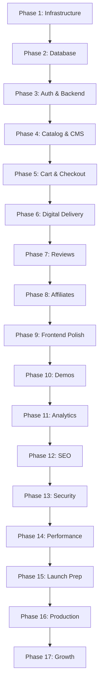

# Waterfall Implementation Phases - HTML Tools Store
## Complete System Build Checklist

This document breaks down the entire system from `system-design-comprehensive.md` into logical, sequential phases following the waterfall methodology. Each phase MUST be completed and verified before proceeding to the next phase.

---

## Phase 1: Infrastructure Foundation & Core Setup
**Duration: Week 1-2**  
**Status: [ ] Not Started**

### 1.1 Development Environment Setup
- [ ] Install Node.js (latest LTS version)
- [ ] Install PostgreSQL locally for development
- [ ] Install Git and configure SSH keys
- [ ] Set up code editor (VS Code recommended) with extensions:
  - [ ] ESLint
  - [ ] Prettier
  - [ ] Tailwind CSS IntelliSense
  - [ ] PostgreSQL client
- [ ] Install Docker and Docker Compose
- [ ] Install Postman or similar API testing tool

### 1.2 Cloud Services Account Creation
- [ ] Create Supabase account and project
  - [ ] Note down Project URL
  - [ ] Note down Anon Key
  - [ ] Note down Service Role Key
- [ ] Create Cloudflare account
  - [ ] Set up R2 storage buckets:
    - [ ] Development bucket
    - [ ] Staging bucket
    - [ ] Production bucket
  - [ ] Configure Cloudflare Images
  - [ ] Set up API tokens for R2 access
- [ ] Create payment provider accounts:
  - [ ] Stripe account (test mode first)
  - [ ] PayPal Developer account
  - [ ] PayHero account for M-Pesa integration
- [ ] Create email service account (SendGrid/Mailgun/AWS SES)
- [ ] Create monitoring service account (optional: Sentry, LogRocket)

### 1.3 Repository and Version Control
- [ ] Create GitHub/GitLab repository
- [ ] Set up branch protection rules:
  - [ ] Protect `main` branch
  - [ ] Protect `develop` branch
  - [ ] Require PR reviews
- [ ] Create branch structure:
  ```
  main (production)
  ├── develop (staging)
  ├── feature/* (feature branches)
  ├── fix/* (bug fix branches)
  └── release/* (release branches)
  ```
- [ ] Set up commit conventions (Conventional Commits)
- [ ] Create `.gitignore` file with proper exclusions
- [ ] Create issue templates:
  - [ ] Bug report template
  - [ ] Feature request template
  - [ ] Task template
  - [ ] Security issue template

### 1.4 Project Structure Creation
- [ ] Initialize monorepo structure:
  ```
  html-tools-store/
  ├── apps/
  │   ├── web/          # Next.js frontend
  │   └── api/          # Backend API
  ├── packages/
  │   ├── database/     # Database schemas and migrations
  │   ├── shared/       # Shared utilities and types
  │   └── ui/          # Shared UI components
  ├── infrastructure/
  │   ├── docker/
  │   └── scripts/
  ├── docs/
  │   ├── adr/         # Architecture Decision Records
  │   ├── api/         # API documentation
  │   ├── runbooks/    # Operational runbooks
  │   └── security/    # Security documentation
  └── tests/
      ├── e2e/
      └── integration/
  ```

### 1.5 Development Tooling Setup
- [ ] Initialize package managers:
  - [ ] Set up npm/yarn/pnpm workspaces
  - [ ] Create root `package.json`
- [ ] Configure TypeScript:
  - [ ] Create `tsconfig.json` files
  - [ ] Set up path aliases
  - [ ] Enable strict mode
- [ ] Set up linting and formatting:
  - [ ] Configure ESLint with rules
  - [ ] Configure Prettier
  - [ ] Set up lint-staged
  - [ ] Configure Husky pre-commit hooks
- [ ] Set up testing framework:
  - [ ] Install and configure Jest/Vitest
  - [ ] Set up testing utilities
  - [ ] Configure test coverage reporting

### 1.6 CI/CD Pipeline Foundation
- [ ] Set up GitHub Actions/GitLab CI:
  - [ ] Create workflow files directory
  - [ ] Set up environment secrets
  - [ ] Create basic pipeline structure:
    ```yaml
    - Install dependencies
    - Run type checking
    - Run linting
    - Run tests
    - Build application
    - Deploy (later phases)
    ```
- [ ] Configure environment variables management:
  - [ ] Create `.env.example` files
  - [ ] Set up environment variable validation
  - [ ] Document all required variables

### 1.7 Documentation Foundation
- [ ] Create README.md with:
  - [ ] Project overview
  - [ ] Setup instructions
  - [ ] Development guidelines
  - [ ] Contribution guidelines
- [ ] Create CONTRIBUTING.md
- [ ] Create CODE_OF_CONDUCT.md
- [ ] Create SECURITY.md
- [ ] Initialize ADR (Architecture Decision Records) system

**Phase 1 Verification Checklist:**
- [ ] All developer tools installed and configured
- [ ] All cloud service accounts created and API keys secured
- [ ] Repository structure complete with protection rules
- [ ] Basic CI/CD pipeline running successfully
- [ ] Team can clone, install, and run hello-world locally

---

## Phase 2: Database Design & Implementation
**Duration: Week 3**  
**Status: [ ] Not Started**  
**Prerequisite: Phase 1 Complete**

### 2.1 Database Schema Implementation

#### 2.1.1 Core User & Authentication Tables
```sql
-- Create all tables exactly as specified in the system design

-- Users table
CREATE TABLE users (
    user_id UUID PRIMARY KEY DEFAULT gen_random_uuid(),
    name TEXT NOT NULL,
    email TEXT UNIQUE NOT NULL,
    password_hash TEXT NOT NULL,
    role TEXT CHECK (role IN ('admin', 'affiliate', 'customer')) DEFAULT 'customer',
    created_at TIMESTAMPTZ DEFAULT now(),
    updated_at TIMESTAMPTZ DEFAULT now()
);
CREATE INDEX idx_users_email ON users(email);

-- Identity providers
CREATE TABLE identities (
    id UUID PRIMARY KEY DEFAULT gen_random_uuid(),
    user_id UUID REFERENCES users(user_id) ON DELETE CASCADE,
    provider TEXT CHECK (provider IN ('supabase', 'google', 'github', 'passkey')),
    provider_subject TEXT NOT NULL,
    created_at TIMESTAMPTZ DEFAULT now(),
    UNIQUE(user_id, provider, provider_subject)
);

-- Sessions
CREATE TABLE sessions (
    id UUID PRIMARY KEY DEFAULT gen_random_uuid(),
    user_id UUID REFERENCES users(user_id) ON DELETE CASCADE,
    session_token_hash TEXT NOT NULL,
    device_info JSONB NULL,
    ip_hash TEXT,
    mfa_level TEXT CHECK (mfa_level IN ('none', 'totp', 'passkey')) DEFAULT 'none',
    created_at TIMESTAMPTZ DEFAULT now(),
    last_seen_at TIMESTAMPTZ,
    expires_at TIMESTAMPTZ,
    revoked_at TIMESTAMPTZ NULL
);
CREATE INDEX idx_sessions_userid ON sessions(user_id);
CREATE INDEX idx_sessions_revoked ON sessions(revoked_at);

-- Role mapping
CREATE TABLE role_map (
    user_id UUID REFERENCES users(user_id),
    role TEXT CHECK (role IN ('user', 'affiliate', 'admin')),
    PRIMARY KEY(user_id, role)
);
```

#### 2.1.2 Product Catalog Tables
```sql
-- Categories
CREATE TABLE categories (
    id UUID PRIMARY KEY DEFAULT gen_random_uuid(),
    slug TEXT UNIQUE NOT NULL,
    name TEXT NOT NULL,
    description TEXT,
    parent_id UUID NULL REFERENCES categories(id),
    sort_order INT DEFAULT 0,
    is_active BOOLEAN DEFAULT TRUE,
    created_at TIMESTAMPTZ DEFAULT now(),
    updated_at TIMESTAMPTZ DEFAULT now()
);
CREATE INDEX idx_categories_parent ON categories(parent_id, sort_order);
CREATE INDEX idx_categories_slug ON categories(slug);

-- Products
CREATE TABLE products (
    product_id UUID PRIMARY KEY DEFAULT gen_random_uuid(),
    slug TEXT UNIQUE NOT NULL,
    sku TEXT UNIQUE,
    title TEXT NOT NULL,
    subtitle TEXT NULL,
    description TEXT,
    description_md TEXT,
    price DECIMAL(10,2) NOT NULL,
    price_cents INT NOT NULL,
    currency TEXT NOT NULL DEFAULT 'USD',
    category_id UUID REFERENCES categories(id) NULL,
    cover_image_id UUID NULL,
    image_url TEXT,
    is_active BOOLEAN DEFAULT TRUE,
    rating_cache NUMERIC DEFAULT 0.0,
    rating_count INT DEFAULT 0,
    created_by UUID REFERENCES users(user_id),
    created_at TIMESTAMPTZ DEFAULT now(),
    updated_at TIMESTAMPTZ DEFAULT now()
);
CREATE INDEX idx_products_slug ON products(slug);
CREATE INDEX idx_products_created_by ON products(created_by);
-- Add full-text search index
CREATE INDEX idx_products_search ON products USING gin(to_tsvector('english', title || ' ' || COALESCE(subtitle, '') || ' ' || COALESCE(description, '')));

-- Product versions
CREATE TABLE product_versions (
    id UUID PRIMARY KEY DEFAULT gen_random_uuid(),
    product_id UUID REFERENCES products(product_id) ON DELETE CASCADE,
    version_semver TEXT NOT NULL,
    changelog_md TEXT,
    r2_key_package TEXT NOT NULL,
    r2_key_zip TEXT NOT NULL,
    license_template_id UUID,
    is_latest BOOLEAN DEFAULT FALSE,
    created_at TIMESTAMPTZ DEFAULT now(),
    UNIQUE(product_id, version_semver)
);

-- Tags
CREATE TABLE tags (
    id UUID PRIMARY KEY DEFAULT gen_random_uuid(),
    slug TEXT UNIQUE NOT NULL,
    label TEXT NOT NULL
);

-- Product tags
CREATE TABLE product_tags (
    product_id UUID REFERENCES products(product_id) ON DELETE CASCADE,
    tag_id UUID REFERENCES tags(id) ON DELETE CASCADE,
    PRIMARY KEY(product_id, tag_id)
);

-- Bundles
CREATE TABLE bundles (
    id UUID PRIMARY KEY DEFAULT gen_random_uuid(),
    slug TEXT UNIQUE NOT NULL,
    title TEXT NOT NULL,
    description_md TEXT,
    price_cents INT NOT NULL,
    currency TEXT NOT NULL DEFAULT 'USD',
    is_active BOOLEAN DEFAULT TRUE,
    created_at TIMESTAMPTZ DEFAULT now(),
    updated_at TIMESTAMPTZ DEFAULT now()
);

-- Bundle items
CREATE TABLE bundle_items (
    bundle_id UUID REFERENCES bundles(id) ON DELETE CASCADE,
    product_id UUID REFERENCES products(product_id) ON DELETE CASCADE,
    PRIMARY KEY(bundle_id, product_id)
);

-- Assets
CREATE TABLE assets (
    id UUID PRIMARY KEY DEFAULT gen_random_uuid(),
    owner_type TEXT CHECK (owner_type IN ('product', 'blogpost', 'post', 'page', 'user_avatar', 'og_image')),
    owner_id UUID,
    r2_key TEXT,
    cf_image_id TEXT,
    url TEXT,
    alt_text TEXT,
    mime_type TEXT,
    file_size INT,
    created_at TIMESTAMPTZ DEFAULT now()
);
CREATE INDEX idx_assets_owner ON assets(owner_type, owner_id);
```

#### 2.1.3 Orders & Commerce Tables
```sql
-- Orders
CREATE TABLE orders (
    order_id UUID PRIMARY KEY DEFAULT gen_random_uuid(),
    user_id UUID REFERENCES users(user_id),
    status TEXT CHECK (status IN ('pending', 'paid', 'failed', 'refunded', 'cancelled')) DEFAULT 'pending',
    subtotal_cents INT NOT NULL,
    discount_cents INT DEFAULT 0,
    tax_cents INT DEFAULT 0,
    total_cents INT NOT NULL,
    total_amount DECIMAL(10,2) NOT NULL,
    currency TEXT NOT NULL,
    payment_status TEXT CHECK (payment_status IN ('pending', 'paid', 'failed', 'refunded')) DEFAULT 'pending',
    affiliate_id UUID NULL,
    metadata JSONB NULL,
    created_at TIMESTAMPTZ DEFAULT now(),
    paid_at TIMESTAMPTZ NULL
);
CREATE INDEX idx_orders_userid_created ON orders(user_id, created_at);
CREATE INDEX idx_orders_status ON orders(status);
CREATE INDEX idx_orders_affiliate ON orders(affiliate_id);

-- Order items
CREATE TABLE order_items (
    id UUID PRIMARY KEY DEFAULT gen_random_uuid(),
    order_id UUID REFERENCES orders(order_id) ON DELETE CASCADE,
    product_id UUID REFERENCES products(product_id),
    product_version_id UUID REFERENCES product_versions(id),
    item_type TEXT CHECK (item_type IN ('product', 'bundle')),
    unit_price_cents INT,
    quantity INT DEFAULT 1,
    created_at TIMESTAMPTZ DEFAULT now()
);

-- Payments
CREATE TABLE payments (
    id UUID PRIMARY KEY DEFAULT gen_random_uuid(),
    order_id UUID REFERENCES orders(order_id) ON DELETE CASCADE,
    provider TEXT CHECK (provider IN ('stripe', 'paypal', 'payhero')) NOT NULL,
    provider_payment_id TEXT,
    amount_cents INT,
    currency TEXT,
    status TEXT CHECK (status IN ('pending', 'succeeded', 'failed')),
    raw_payload JSONB,
    created_at TIMESTAMPTZ DEFAULT now(),
    UNIQUE(provider, provider_payment_id)
);
```

#### 2.1.4 Licensing & Downloads Tables
```sql
-- Licenses
CREATE TABLE licenses (
    id UUID PRIMARY KEY DEFAULT gen_random_uuid(),
    user_id UUID REFERENCES users(user_id) ON DELETE CASCADE,
    product_version_id UUID REFERENCES product_versions(id) ON DELETE CASCADE,
    license_key TEXT UNIQUE,
    license_type TEXT CHECK (license_type IN ('personal', 'team', 'commercial')),
    is_active BOOLEAN DEFAULT TRUE,
    issued_at TIMESTAMPTZ DEFAULT now(),
    revoked_at TIMESTAMPTZ NULL
);
CREATE INDEX idx_licenses_user ON licenses(user_id);

-- Download links
CREATE TABLE download_links (
    id UUID PRIMARY KEY DEFAULT gen_random_uuid(),
    license_id UUID REFERENCES licenses(id) ON DELETE CASCADE,
    product_version_id UUID REFERENCES product_versions(id),
    token TEXT UNIQUE NOT NULL,
    expires_at TIMESTAMPTZ NOT NULL,
    max_uses INT DEFAULT 5,
    uses_count INT DEFAULT 0,
    last_used_at TIMESTAMPTZ NULL,
    ip_hash TEXT,
    created_at TIMESTAMPTZ DEFAULT now()
);
CREATE INDEX idx_downloads_expires ON download_links(expires_at);
CREATE INDEX idx_downloads_token ON download_links(token);
```

#### 2.1.5 Reviews & Ratings Tables
```sql
-- Reviews
CREATE TABLE reviews (
    id UUID PRIMARY KEY DEFAULT gen_random_uuid(),
    user_id UUID REFERENCES users(user_id),
    product_id UUID REFERENCES products(product_id),
    rating INT CHECK (rating BETWEEN 1 AND 5),
    body_md TEXT,
    status TEXT CHECK (status IN ('pending', 'approved', 'rejected')) DEFAULT 'pending',
    created_at TIMESTAMPTZ DEFAULT now(),
    updated_at TIMESTAMPTZ DEFAULT now()
);
CREATE INDEX idx_reviews_product_status ON reviews(product_id, status);

-- Review proofs
CREATE TABLE review_proofs (
    id UUID PRIMARY KEY DEFAULT gen_random_uuid(),
    review_id UUID REFERENCES reviews(id) ON DELETE CASCADE,
    order_item_id UUID REFERENCES order_items(id)
);
```

#### 2.1.6 Affiliate System Tables
```sql
-- Affiliates
CREATE TABLE affiliates (
    affiliate_id UUID PRIMARY KEY DEFAULT gen_random_uuid(),
    user_id UUID REFERENCES users(user_id) UNIQUE,
    code TEXT UNIQUE NOT NULL,
    referral_code TEXT UNIQUE NOT NULL,
    display_name TEXT,
    status TEXT CHECK (status IN ('pending', 'approved', 'blocked')),
    commission_rate DECIMAL(5,2) DEFAULT 10.00,
    commission_bps INT DEFAULT 1000,
    created_at TIMESTAMPTZ DEFAULT now()
);

-- Affiliate clicks
CREATE TABLE affiliate_clicks (
    id UUID PRIMARY KEY DEFAULT gen_random_uuid(),
    affiliate_id UUID REFERENCES affiliates(affiliate_id),
    click_ts TIMESTAMPTZ DEFAULT now(),
    landing_url TEXT,
    ip_hash TEXT,
    user_agent TEXT,
    utm_params JSONB NULL
);
CREATE INDEX idx_affclicks_affiliate_ts ON affiliate_clicks(affiliate_id, click_ts);

-- Affiliate conversions
CREATE TABLE affiliate_conversions (
    id UUID PRIMARY KEY DEFAULT gen_random_uuid(),
    affiliate_id UUID REFERENCES affiliates(affiliate_id),
    order_id UUID REFERENCES orders(order_id) UNIQUE,
    commission_cents INT,
    created_at TIMESTAMPTZ DEFAULT now()
);

-- Commissions
CREATE TABLE commissions (
    commission_id UUID PRIMARY KEY DEFAULT gen_random_uuid(),
    affiliate_id UUID REFERENCES affiliates(affiliate_id),
    order_id UUID REFERENCES orders(order_id),
    amount DECIMAL(10,2) NOT NULL,
    status TEXT CHECK (status IN ('pending', 'approved', 'paid')) DEFAULT 'pending',
    created_at TIMESTAMPTZ DEFAULT now()
);

-- Payouts
CREATE TABLE payouts (
    id UUID PRIMARY KEY DEFAULT gen_random_uuid(),
    affiliate_id UUID REFERENCES affiliates(affiliate_id),
    amount_cents INT,
    currency TEXT,
    status TEXT CHECK (status IN ('pending', 'paid', 'failed')),
    requested_at TIMESTAMPTZ DEFAULT now(),
    paid_at TIMESTAMPTZ NULL,
    notes TEXT
);
CREATE INDEX idx_payouts_affiliate ON payouts(affiliate_id);
```

#### 2.1.7 CMS Tables
```sql
-- CMS Pages
CREATE TABLE cms_pages (
    page_id UUID PRIMARY KEY DEFAULT gen_random_uuid(),
    slug TEXT UNIQUE NOT NULL,
    title TEXT NOT NULL,
    content_html TEXT,
    content_json JSONB,
    body_json JSONB,
    status TEXT CHECK (status IN ('draft', 'scheduled', 'published')),
    published_at TIMESTAMPTZ NULL,
    og_image_id UUID NULL REFERENCES assets(id),
    seo_title TEXT,
    seo_description TEXT,
    created_by UUID REFERENCES users(user_id),
    created_at TIMESTAMPTZ DEFAULT now(),
    updated_at TIMESTAMPTZ DEFAULT now()
);

-- Blog posts
CREATE TABLE blog_posts (
    blog_id UUID PRIMARY KEY DEFAULT gen_random_uuid(),
    title TEXT NOT NULL,
    slug TEXT UNIQUE NOT NULL,
    excerpt TEXT,
    content_html TEXT,
    content_json JSONB,
    body_json JSONB,
    author_id UUID REFERENCES users(user_id),
    status TEXT CHECK (status IN ('draft', 'scheduled', 'published')),
    published_at TIMESTAMPTZ NULL,
    og_image_id UUID NULL REFERENCES assets(id),
    seo_title TEXT,
    seo_description TEXT,
    created_by UUID REFERENCES users(user_id),
    created_at TIMESTAMPTZ DEFAULT now(),
    updated_at TIMESTAMPTZ DEFAULT now()
);

-- Post tags
CREATE TABLE post_tags (
    post_id UUID REFERENCES blog_posts(blog_id),
    tag_id UUID REFERENCES tags(id),
    PRIMARY KEY(post_id, tag_id)
);

-- Pages (additional)
CREATE TABLE pages (
    id UUID PRIMARY KEY DEFAULT gen_random_uuid(),
    slug TEXT UNIQUE,
    title TEXT,
    body_json JSONB,
    status TEXT,
    published_at TIMESTAMPTZ,
    created_at TIMESTAMPTZ DEFAULT now(),
    updated_at TIMESTAMPTZ DEFAULT now()
);
```

#### 2.1.8 System Administration Tables
```sql
-- Feature flags
CREATE TABLE feature_flags (
    key TEXT PRIMARY KEY,
    value JSONB,
    updated_at TIMESTAMPTZ DEFAULT now()
);

-- Redirects
CREATE TABLE redirects (
    id UUID PRIMARY KEY DEFAULT gen_random_uuid(),
    from_path TEXT UNIQUE,
    to_url TEXT,
    status_code INT DEFAULT 301,
    created_at TIMESTAMPTZ DEFAULT now()
);

-- Audit log
CREATE TABLE audit_log (
    id UUID PRIMARY KEY DEFAULT gen_random_uuid(),
    actor_user_id UUID REFERENCES users(user_id),
    action TEXT,
    target_type TEXT,
    target_id UUID,
    meta JSONB,
    created_at TIMESTAMPTZ DEFAULT now()
);

-- Events tracking
CREATE TABLE events (
    id UUID PRIMARY KEY DEFAULT gen_random_uuid(),
    user_id UUID NULL REFERENCES users(user_id),
    event_type TEXT NOT NULL,
    payload JSONB,
    ip_hash TEXT,
    user_agent TEXT,
    created_at TIMESTAMPTZ DEFAULT now()
);
CREATE INDEX idx_events_type_created ON events(event_type, created_at);
CREATE INDEX idx_events_user_created ON events(user_id, created_at);
```

### 2.2 Database Configuration & Security
- [ ] Set up Row Level Security (RLS) policies:
  - [ ] Users can only see their own data
  - [ ] Public can view published products/posts
  - [ ] Admins have full access
  - [ ] Affiliates can see their metrics
- [ ] Create database functions and triggers:
  - [ ] Auto-update `updated_at` timestamps
  - [ ] Calculate order totals
  - [ ] Update product ratings cache
  - [ ] Generate unique slugs
- [ ] Set up database roles:
  - [ ] Application role with limited permissions
  - [ ] Admin role for migrations
  - [ ] Read-only role for analytics
- [ ] Configure connection pooling
- [ ] Set up database backups:
  - [ ] Daily automated backups
  - [ ] Point-in-time recovery enabled
  - [ ] Test restore procedure

### 2.3 Migration System Setup
- [ ] Create migration tool configuration
- [ ] Write initial migration files
- [ ] Set up migration versioning
- [ ] Create rollback scripts
- [ ] Document migration procedures
- [ ] Test migrations on fresh database

### 2.4 Seed Data Creation
- [ ] Create seed data scripts:
  - [ ] Admin user account
  - [ ] Sample categories
  - [ ] Sample products with versions
  - [ ] Sample blog posts
  - [ ] Test affiliate account
  - [ ] Demo orders for testing
- [ ] Create data generation utilities
- [ ] Document seed data usage

**Phase 2 Verification Checklist:**
- [ ] All tables created successfully
- [ ] Indexes and constraints in place
- [ ] RLS policies configured and tested
- [ ] Migration system working
- [ ] Can seed and reset database
- [ ] Database backup and restore tested

---

## Phase 3: Authentication & Core Backend
**Duration: Week 4-5**  
**Status: [ ] Not Started**  
**Prerequisite: Phase 2 Complete**

### 3.1 Backend API Setup
- [ ] Initialize Express/Fastify application:
  ```typescript
  // Basic structure
  src/
  ├── config/
  │   ├── database.ts
  │   ├── auth.ts
  │   └── storage.ts
  ├── middleware/
  │   ├── auth.ts
  │   ├── error.ts
  │   ├── logging.ts
  │   └── validation.ts
  ├── services/
  │   ├── auth/
  │   ├── user/
  │   └── email/
  ├── routes/
  │   ├── auth.routes.ts
  │   └── user.routes.ts
  ├── utils/
  └── app.ts
  ```
- [ ] Configure middleware stack:
  - [ ] CORS configuration
  - [ ] Body parser
  - [ ] Cookie parser
  - [ ] Helmet for security headers
  - [ ] Rate limiting
  - [ ] Request logging

### 3.2 Authentication Implementation
- [ ] Supabase Auth integration:
  - [ ] Configure Supabase client
  - [ ] Set up JWT verification
  - [ ] Implement token refresh logic
- [ ] Session management:
  - [ ] Create session endpoints
  - [ ] Implement httpOnly cookie handling
  - [ ] Session storage in database
  - [ ] Device tracking
- [ ] OAuth provider setup:
  - [ ] Google OAuth configuration
  - [ ] GitHub OAuth configuration
  - [ ] OAuth callback handlers
- [ ] Passkey/WebAuthn support:
  - [ ] Registration flow
  - [ ] Authentication flow
  - [ ] Device management

### 3.3 Core Auth Endpoints
```typescript
// Implement these endpoints
POST /auth/register
POST /auth/login
POST /auth/logout
POST /auth/refresh
GET  /auth/me
POST /auth/forgot-password
POST /auth/reset-password
POST /auth/verify-email
POST /auth/resend-verification
```

### 3.4 User Management
- [ ] User profile endpoints:
  ```typescript
  GET    /users/profile
  PUT    /users/profile
  DELETE /users/account
  GET    /users/sessions
  DELETE /users/sessions/:id
  ```
- [ ] Multi-factor authentication:
  - [ ] TOTP setup endpoints
  - [ ] TOTP verification
  - [ ] Backup codes generation
  - [ ] MFA enforcement logic

### 3.5 Authorization System
- [ ] Role-based access control (RBAC):
  - [ ] Role checking middleware
  - [ ] Permission definitions
  - [ ] Admin route protection
- [ ] Resource-based permissions:
  - [ ] Owner verification
  - [ ] Affiliate access control
  - [ ] Public vs private resources

### 3.6 Email Service Integration
- [ ] Configure email provider (SendGrid/Mailgun/SES)
- [ ] Create email templates:
  - [ ] Welcome email
  - [ ] Email verification
  - [ ] Password reset
  - [ ] Order confirmation
  - [ ] Download ready
- [ ] Email queue system
- [ ] Email tracking (opens/clicks)

### 3.7 Security Implementation
- [ ] Input validation with Zod
- [ ] SQL injection prevention
- [ ] XSS protection
- [ ] CSRF token implementation
- [ ] Security headers configuration
- [ ] API key management for services

**Phase 3 Verification Checklist:**
- [ ] User can register and receive verification email
- [ ] User can login with email/password
- [ ] OAuth providers working
- [ ] Sessions persist across requests
- [ ] Protected routes return 401 for unauthorized
- [ ] Admin routes restricted properly
- [ ] Email templates rendering correctly

---

## Phase 4: Product Catalog & CMS
**Duration: Week 6-7**  
**Status: [ ] Not Started**  
**Prerequisite: Phase 3 Complete**

### 4.1 Product Service Implementation
- [ ] Product CRUD operations:
  ```typescript
  // Admin endpoints
  POST   /admin/products
  PUT    /admin/products/:id
  DELETE /admin/products/:id
  POST   /admin/products/:id/versions
  PUT    /admin/products/:id/versions/:versionId
  
  // Public endpoints
  GET /products
  GET /products/:slug
  GET /products/:slug/versions
  ```
- [ ] Product search and filtering:
  - [ ] Full-text search
  - [ ] Category filtering
  - [ ] Tag filtering
  - [ ] Price range filtering
  - [ ] Sorting options
- [ ] Pagination implementation
- [ ] Product image handling:
  - [ ] Upload to Cloudflare Images
  - [ ] Multiple image support
  - [ ] Image optimization
  - [ ] Thumbnail generation

### 4.2 Category Management
- [ ] Category CRUD operations
- [ ] Hierarchical category support
- [ ] Category sorting
- [ ] Product-category assignment

### 4.3 Tag System
- [ ] Tag CRUD operations
- [ ] Tag suggestions/autocomplete
- [ ] Popular tags calculation
- [ ] Tag-based recommendations

### 4.4 Bundle Management
- [ ] Bundle CRUD operations:
  ```typescript
  POST   /admin/bundles
  PUT    /admin/bundles/:id
  DELETE /admin/bundles/:id
  POST   /admin/bundles/:id/products
  DELETE /admin/bundles/:id/products/:productId
  
  GET /bundles
  GET /bundles/:slug
  ```
- [ ] Bundle pricing logic
- [ ] Bundle validation (no circular references)

### 4.5 CMS Implementation
- [ ] Blog post management:
  ```typescript
  // Admin endpoints
  POST   /admin/posts
  PUT    /admin/posts/:id
  DELETE /admin/posts/:id
  POST   /admin/posts/:id/publish
  POST   /admin/posts/:id/unpublish
  
  // Public endpoints
  GET /blog
  GET /blog/:slug
  GET /blog/tags/:tag
  ```
- [ ] Page management:
  ```typescript
  POST   /admin/pages
  PUT    /admin/pages/:id
  DELETE /admin/pages/:id
  
  GET /pages/:slug
  ```
- [ ] Rich text editor integration
- [ ] Media library implementation
- [ ] SEO metadata management
- [ ] Content scheduling

### 4.6 Asset Management
- [ ] File upload to Cloudflare R2
- [ ] Asset organization system
- [ ] Asset metadata tracking
- [ ] Asset usage tracking
- [ ] Orphaned asset cleanup

### 4.7 Frontend Integration (Initial)
- [ ] Set up Next.js application:
  ```
  app/
  ├── (public)/
  │   ├── page.tsx              # Homepage
  │   ├── products/
  │   │   ├── page.tsx          # Product listing
  │   │   └── [slug]/
  │   │       └── page.tsx      # Product detail
  │   ├── blog/
  │   │   ├── page.tsx          # Blog listing
  │   │   └── [slug]/
  │   │       └── page.tsx      # Blog post
  │   └── [slug]/
  │       └── page.tsx          # CMS pages
  └── (admin)/
      └── admin/
          └── layout.tsx          # Admin layout
  ```
- [ ] Configure SSG/ISR for products and blog
- [ ] Implement product listing page
- [ ] Implement product detail page
- [ ] Implement blog listing page
- [ ] Implement blog post page

**Phase 4 Verification Checklist:**
- [ ] Admin can create/edit/delete products
- [ ] Products display on public site
- [ ] Search and filtering works
- [ ] Blog posts can be created and published
- [ ] Images upload to Cloudflare successfully
- [ ] SEO metadata properly rendered
- [ ] Content scheduling works

---

## Phase 5: Shopping Cart & Checkout
**Duration: Week 8-9**  
**Status: [ ] Not Started**  
**Prerequisite: Phase 4 Complete**

### 5.1 Shopping Cart Implementation
- [ ] Cart state management (React Context/Zustand)
- [ ] Cart persistence (localStorage + database)
- [ ] Cart API endpoints:
  ```typescript
  POST   /cart/items
  PUT    /cart/items/:id
  DELETE /cart/items/:id
  GET    /cart
  POST   /cart/clear
  ```
- [ ] Cart calculations:
  - [ ] Subtotal calculation
  - [ ] Tax calculation
  - [ ] Discount application
  - [ ] Currency conversion

### 5.2 Checkout Process
- [ ] Checkout flow pages:
  - [ ] Cart review
  - [ ] Customer information
  - [ ] Payment method selection
  - [ ] Order confirmation
- [ ] Guest checkout support
- [ ] Address validation
- [ ] Order creation logic

### 5.3 Payment Gateway Integration

#### 5.3.1 Stripe Integration
- [ ] Stripe SDK setup
- [ ] Payment intent creation
- [ ] Stripe Elements integration
- [ ] 3D Secure handling
- [ ] Webhook endpoint:
  ```typescript
  POST /webhooks/stripe
  ```
- [ ] Webhook signature verification
- [ ] Payment confirmation handling

#### 5.3.2 PayPal Integration
- [ ] PayPal SDK setup
- [ ] PayPal button integration
- [ ] Order creation
- [ ] Webhook handling:
  ```typescript
  POST /webhooks/paypal
  ```
- [ ] Payment capture

#### 5.3.3 PayHero (M-Pesa) Integration
- [ ] PayHero API setup
- [ ] STK push implementation
- [ ] Payment status polling
- [ ] Webhook handling:
  ```typescript
  POST /webhooks/payhero
  ```
- [ ] M-Pesa specific UI elements

### 5.4 Order Management
- [ ] Order service implementation:
  ```typescript
  POST /orders
  GET  /orders/:id
  GET  /orders/user/:userId
  PUT  /orders/:id/status
  ```
- [ ] Order status workflow:
  - [ ] Pending → Processing
  - [ ] Processing → Paid
  - [ ] Paid → Completed
  - [ ] Refund handling
- [ ] Order confirmation emails
- [ ] Invoice generation

### 5.5 Tax & Pricing
- [ ] Tax calculation service
- [ ] Multi-currency support
- [ ] Regional pricing
- [ ] Coupon/discount system:
  ```typescript
  POST /coupons/validate
  GET  /admin/coupons
  POST /admin/coupons
  ```

### 5.6 Affiliate Attribution
- [ ] Cookie-based tracking
- [ ] Affiliate link handling:
  ```typescript
  GET /ref/:code
  ```
- [ ] Attribution to orders
- [ ] Commission calculation

**Phase 5 Verification Checklist:**
- [ ] Cart persists across sessions
- [ ] Complete checkout flow works
- [ ] All payment methods functional
- [ ] Orders created with correct status
- [ ] Webhooks processing successfully
- [ ] Confirmation emails sent
- [ ] Affiliate attribution working

---

## Phase 6: Digital Delivery System
**Duration: Week 10**  
**Status: [ ] Not Started**  
**Prerequisite: Phase 5 Complete**

### 6.1 License Generation
- [ ] License key generation algorithm
- [ ] License service implementation:
  ```typescript
  POST /licenses/generate
  GET  /licenses/user/:userId
  GET  /licenses/:id
  PUT  /licenses/:id/revoke
  ```
- [ ] License types handling:
  - [ ] Personal license
  - [ ] Team license
  - [ ] Commercial license
- [ ] License validation system

### 6.2 File Storage Setup
- [ ] Cloudflare R2 bucket configuration:
  - [ ] Bucket creation
  - [ ] CORS policies
  - [ ] Lifecycle rules
- [ ] File organization structure:
  ```
  /products/{product_id}/{version}/package.zip
  /licenses/{license_id}/license.txt
  /temp/{upload_id}/file.ext
  ```
- [ ] Upload handling for large files
- [ ] File validation and scanning

### 6.3 Download System
- [ ] Secure download implementation:
  ```typescript
  POST /downloads/generate-link
  GET  /downloads/:token
  GET  /orders/:id/downloads
  ```
- [ ] Signed URL generation:
  - [ ] 5-minute expiration
  - [ ] IP restriction option
  - [ ] Download counting
- [ ] Rate limiting per license
- [ ] Download history tracking

### 6.4 License Watermarking
- [ ] ZIP file manipulation
- [ ] License file injection:
  ```json
  {
    "license_key": "XXXX-XXXX-XXXX-XXXX",
    "purchaser_name": "John Doe",
    "purchaser_email": "john@example.com",
    "order_id": "order-uuid",
    "issued_at": "2024-01-15T10:30:00Z",
    "license_type": "personal"
  }
  ```
- [ ] File integrity preservation
- [ ] Watermark verification tool

### 6.5 Customer Download Portal
- [ ] Account downloads page
- [ ] License key display
- [ ] Download history
- [ ] Re-download functionality
- [ ] Version selection
- [ ] License transfer (if applicable)

### 6.6 Admin File Management
- [ ] Product file upload interface
- [ ] Version management
- [ ] File replacement without breaking links
- [ ] Bulk operations
- [ ] Storage analytics

**Phase 6 Verification Checklist:**
- [ ] Licenses generated on successful payment
- [ ] Files upload to R2 successfully
- [ ] Download links expire after 5 minutes
- [ ] Watermarking adds license info
- [ ] Rate limiting prevents abuse
- [ ] Customers can re-download purchases

---

## Phase 7: Reviews & Social Proof
**Duration: Week 11**  
**Status: [ ] Not Started**  
**Prerequisite: Phase 6 Complete**

### 7.1 Review System Implementation
- [ ] Review submission:
  ```typescript
  POST /products/:id/reviews
  GET  /products/:id/reviews
  PUT  /reviews/:id
  DELETE /reviews/:id
  ```
- [ ] Purchase verification
- [ ] Rating calculation
- [ ] Review moderation queue

### 7.2 Review Management
- [ ] Admin moderation interface:
  ```typescript
  GET  /admin/reviews/pending
  PUT  /admin/reviews/:id/approve
  PUT  /admin/reviews/:id/reject
  ```
- [ ] Automated content filtering
- [ ] Spam detection
- [ ] Review responses

### 7.3 Rating System
- [ ] Average rating calculation
- [ ] Rating distribution
- [ ] Rating cache updates
- [ ] Rating display widgets

### 7.4 Review Display
- [ ] Review listing component
- [ ] Pagination
- [ ] Sorting options
- [ ] Filtering by rating
- [ ] Verified purchase badges
- [ ] Helpful/unhelpful voting

### 7.5 SEO Enhancement
- [ ] Structured data for reviews
- [ ] Rich snippets
- [ ] Review schema markup
- [ ] Aggregate rating display

**Phase 7 Verification Checklist:**
- [ ] Only verified buyers can review
- [ ] Reviews require moderation
- [ ] Ratings update product average
- [ ] Reviews display on product pages
- [ ] Admin can moderate reviews
- [ ] Rich snippets show in search results

---

## Phase 8: Affiliate System
**Duration: Week 12**  
**Status: [ ] Not Started**  
**Prerequisite: Phase 7 Complete**

### 8.1 Affiliate Registration
- [ ] Application system:
  ```typescript
  POST /affiliates/apply
  GET  /affiliates/application-status
  ```
- [ ] Approval workflow
- [ ] Affiliate dashboard access
- [ ] Terms acceptance

### 8.2 Tracking Implementation
- [ ] Click tracking:
  ```typescript
  GET /ref/:code
  POST /affiliates/track-click
  ```
- [ ] Cookie management (24-hour default)
- [ ] Attribution logic
- [ ] Conversion tracking

### 8.3 Affiliate Dashboard
- [ ] Dashboard endpoints:
  ```typescript
  GET /affiliates/stats
  GET /affiliates/clicks
  GET /affiliates/conversions
  GET /affiliates/commissions
  ```
- [ ] Real-time statistics
- [ ] Performance graphs
- [ ] Link generator
- [ ] Marketing materials

### 8.4 Commission Management
- [ ] Commission calculation
- [ ] Commission approval workflow
- [ ] Payout request system:
  ```typescript
  POST /affiliates/request-payout
  GET  /affiliates/payouts
  ```
- [ ] Payout processing
- [ ] Tax documentation

### 8.5 Admin Affiliate Tools
- [ ] Affiliate management:
  ```typescript
  GET  /admin/affiliates
  PUT  /admin/affiliates/:id/approve
  PUT  /admin/affiliates/:id/block
  POST /admin/affiliates/payouts/process
  ```
- [ ] Performance monitoring
- [ ] Fraud detection
- [ ] Bulk operations

**Phase 8 Verification Checklist:**
- [ ] Affiliates can apply and get approved
- [ ] Tracking links work correctly
- [ ] Conversions attributed properly
- [ ] Commission calculations accurate
- [ ] Payout requests can be processed
- [ ] Admin can manage affiliates

---

## Phase 9: Frontend Polish & UI/UX
**Duration: Week 13-14**  
**Status: [ ] Not Started**  
**Prerequisite: Phase 8 Complete**

### 9.1 Design System Implementation
- [ ] Set up design tokens:
  ```typescript
  // tokens/
  ├── colors.ts
  ├── typography.ts
  ├── spacing.ts
  ├── shadows.ts
  └── breakpoints.ts
  ```
- [ ] Configure Tailwind CSS
- [ ] Set up CSS variables
- [ ] Dark mode support
- [ ] Theme switching

### 9.2 Component Library
- [ ] Install and configure ShadCN UI
- [ ] Customize components:
  - [ ] Button variants
  - [ ] Form elements
  - [ ] Cards
  - [ ] Modals
  - [ ] Navigation
  - [ ] Tables
  - [ ] Alerts
- [ ] Create custom components:
  - [ ] Product card
  - [ ] Price display
  - [ ] Rating stars
  - [ ] Download button
  - [ ] License badge

### 9.3 Page Templates
- [ ] Homepage:
  - [ ] Hero section
  - [ ] Featured products
  - [ ] Categories grid
  - [ ] Testimonials
  - [ ] Newsletter signup
- [ ] Product listing:
  - [ ] Filter sidebar
  - [ ] Product grid
  - [ ] Pagination
  - [ ] Sort controls
- [ ] Product detail:
  - [ ] Image gallery
  - [ ] Feature list
  - [ ] Demo section
  - [ ] Reviews
  - [ ] Related products

### 9.4 Animations & Interactions
- [ ] Install Framer Motion
- [ ] Page transitions
- [ ] Loading states
- [ ] Hover effects
- [ ] Scroll animations
- [ ] Micro-interactions

### 9.5 Responsive Design
- [ ] Mobile navigation
- [ ] Touch-friendly interfaces
- [ ] Responsive images
- [ ] Mobile-optimized checkout
- [ ] Table responsiveness

### 9.6 Accessibility
- [ ] Keyboard navigation
- [ ] Screen reader support
- [ ] ARIA labels
- [ ] Focus management
- [ ] Color contrast compliance
- [ ] Alt text for images

### 9.7 Performance Optimization
- [ ] Image lazy loading
- [ ] Code splitting
- [ ] Font optimization
- [ ] Critical CSS
- [ ] Bundle size optimization
- [ ] Prefetching strategies

**Phase 9 Verification Checklist:**
- [ ] Consistent design across all pages
- [ ] All interactive elements have hover/focus states
- [ ] Mobile experience is smooth
- [ ] Animations perform well
- [ ] Accessibility audit passes
- [ ] Lighthouse scores > 90

---

## Phase 10: Interactive Demos & Playground
**Duration: Week 15**  
**Status: [ ] Not Started**  
**Prerequisite: Phase 9 Complete**

### 10.1 Demo Infrastructure
- [ ] Sandbox environment setup
- [ ] iframe isolation
- [ ] CSP configuration for demos
- [ ] Demo hosting strategy

### 10.2 Demo Builder
- [ ] Demo configuration system
- [ ] Code editor integration
- [ ] Live preview functionality
- [ ] Demo templates
- [ ] Sample data sets

### 10.3 Security Implementation
- [ ] Sandbox restrictions:
  ```
  sandbox="allow-scripts allow-same-origin"
  ```
- [ ] Resource limits
- [ ] Network request blocking
- [ ] Malicious code detection

### 10.4 Demo Features
- [ ] Code highlighting
- [ ] Copy code functionality
- [ ] Reset demo option
- [ ] Fullscreen mode
- [ ] Mobile preview
- [ ] Export functionality

### 10.5 Product Integration
- [ ] Demo attachment to products
- [ ] Demo versioning
- [ ] Demo analytics
- [ ] A/B testing demos

**Phase 10 Verification Checklist:**
- [ ] Demos load in isolated environment
- [ ] No security vulnerabilities
- [ ] Code can be copied easily
- [ ] Demos work on mobile
- [ ] Performance impact minimal
- [ ] Analytics tracking demo usage

---

## Phase 11: Analytics & Monitoring
**Duration: Week 16**  
**Status: [ ] Not Started**  
**Prerequisite: Phase 10 Complete**

### 11.1 Analytics Implementation
- [ ] Event tracking system:
  ```typescript
  // Track events
  - page_view
  - product_view
  - add_to_cart
  - checkout_started
  - purchase_complete
  - download_started
  - demo_interaction
  ```
- [ ] Server-side tracking
- [ ] Client-side tracking
- [ ] Event batching
- [ ] Privacy compliance

### 11.2 Business Metrics
- [ ] Sales dashboard:
  - [ ] Revenue metrics
  - [ ] Conversion funnel
  - [ ] Product performance
  - [ ] Customer segments
- [ ] Traffic analytics:
  - [ ] Page views
  - [ ] User sessions
  - [ ] Traffic sources
  - [ ] Geographic data

### 11.3 Monitoring Setup
- [ ] Application monitoring:
  - [ ] Error tracking (Sentry)
  - [ ] Performance monitoring
  - [ ] Uptime monitoring
  - [ ] API monitoring
- [ ] Infrastructure monitoring:
  - [ ] Server metrics
  - [ ] Database performance
  - [ ] Storage usage
  - [ ] CDN performance

### 11.4 Alerting System
- [ ] Alert configuration:
  - [ ] Payment failures
  - [ ] High error rates
  - [ ] Performance degradation
  - [ ] Security events
- [ ] Alert channels:
  - [ ] Email
  - [ ] SMS
  - [ ] Slack/Discord
  - [ ] PagerDuty

### 11.5 Reporting
- [ ] Automated reports:
  - [ ] Daily sales summary
  - [ ] Weekly performance
  - [ ] Monthly business review
  - [ ] Affiliate reports
- [ ] Custom reports
- [ ] Data export functionality

**Phase 11 Verification Checklist:**
- [ ] All key events tracked
- [ ] Dashboards show real-time data
- [ ] Alerts trigger correctly
- [ ] Reports generate on schedule
- [ ] Data retention policies enforced
- [ ] GDPR compliance verified

---

## Phase 12: SEO & Content Marketing
**Duration: Week 17**  
**Status: [ ] Not Started**  
**Prerequisite: Phase 11 Complete**

### 12.1 Technical SEO
- [ ] Meta tag implementation
- [ ] Canonical URLs
- [ ] Sitemap generation:
  ```xml
  /sitemap.xml
  /sitemap-products.xml
  /sitemap-blog.xml
  /sitemap-pages.xml
  ```
- [ ] Robots.txt configuration
- [ ] Schema markup:
  - [ ] Product schema
  - [ ] Article schema
  - [ ] Organization schema
  - [ ] Breadcrumb schema

### 12.2 Content Optimization
- [ ] URL structure optimization
- [ ] Internal linking strategy
- [ ] Content silos
- [ ] Keyword optimization
- [ ] Alt text for images
- [ ] Page speed optimization

### 12.3 Programmatic SEO
- [ ] Landing page templates
- [ ] Dynamic page generation
- [ ] Location-based pages
- [ ] Use-case pages
- [ ] Comparison pages

### 12.4 Content Calendar
- [ ] Editorial calendar setup
- [ ] Content categories:
  - [ ] How-to guides
  - [ ] Tool comparisons
  - [ ] Industry news
  - [ ] Case studies
- [ ] Publishing workflow
- [ ] Content promotion

### 12.5 Link Building
- [ ] Resource page creation
- [ ] Guest posting strategy
- [ ] Partner relationships
- [ ] Social media integration
- [ ] Email outreach templates

**Phase 12 Verification Checklist:**
- [ ] All pages have proper meta tags
- [ ] Sitemap submitted to search engines
- [ ] Schema markup validates
- [ ] Core Web Vitals pass
- [ ] Content calendar active
- [ ] Organic traffic growing

---

## Phase 13: Security Hardening
**Duration: Week 18**  
**Status: [ ] Not Started**  
**Prerequisite: Phase 12 Complete**

### 13.1 Application Security
- [ ] Security headers implementation:
  ```
  Content-Security-Policy
  X-Frame-Options
  X-Content-Type-Options
  Referrer-Policy
  Permissions-Policy
  ```
- [ ] Input sanitization
- [ ] Output encoding
- [ ] SQL injection prevention
- [ ] XSS protection

### 13.2 Authentication Security
- [ ] Password policies
- [ ] Account lockout
- [ ] Session security
- [ ] 2FA enforcement options
- [ ] Suspicious login detection

### 13.3 API Security
- [ ] Rate limiting per endpoint
- [ ] API key rotation
- [ ] Request signing
- [ ] CORS configuration
- [ ] GraphQL query depth limiting

### 13.4 Infrastructure Security
- [ ] Firewall rules
- [ ] DDoS protection
- [ ] SSL/TLS configuration
- [ ] Security scanning
- [ ] Penetration testing

### 13.5 Compliance
- [ ] GDPR compliance:
  - [ ] Privacy policy
  - [ ] Cookie consent
  - [ ] Data export
  - [ ] Right to deletion
- [ ] PCI compliance (for payments)
- [ ] Terms of service
- [ ] Refund policy

### 13.6 Security Monitoring
- [ ] Security event logging
- [ ] Intrusion detection
- [ ] Vulnerability scanning
- [ ] Security updates process
- [ ] Incident response plan

**Phase 13 Verification Checklist:**
- [ ] Security audit passed
- [ ] No critical vulnerabilities
- [ ] Compliance documents ready
- [ ] Security monitoring active
- [ ] Incident response tested
- [ ] Team security training complete

---

## Phase 14: Performance Optimization
**Duration: Week 19**  
**Status: [ ] Not Started**  
**Prerequisite: Phase 13 Complete**

### 14.1 Frontend Performance
- [ ] Bundle optimization:
  - [ ] Code splitting
  - [ ] Tree shaking
  - [ ] Lazy loading
  - [ ] Dynamic imports
- [ ] Asset optimization:
  - [ ] Image compression
  - [ ] WebP/AVIF formats
  - [ ] Font subsetting
  - [ ] SVG optimization

### 14.2 Backend Performance
- [ ] Database optimization:
  - [ ] Query optimization
  - [ ] Index tuning
  - [ ] Connection pooling
  - [ ] Caching strategy
- [ ] API optimization:
  - [ ] Response compression
  - [ ] Field filtering
  - [ ] Pagination optimization
  - [ ] N+1 query prevention

### 14.3 Caching Strategy
- [ ] CDN configuration:
  - [ ] Static asset caching
  - [ ] API response caching
  - [ ] Geographic distribution
- [ ] Application caching:
  - [ ] Redis setup
  - [ ] Session caching
  - [ ] Query result caching
  - [ ] Full-page caching

### 14.4 Load Testing
- [ ] Test scenarios:
  - [ ] Normal traffic
  - [ ] Peak traffic
  - [ ] Spike testing
  - [ ] Endurance testing
- [ ] Performance metrics:
  - [ ] Response times
  - [ ] Throughput
  - [ ] Error rates
  - [ ] Resource usage

### 14.5 Optimization Implementation
- [ ] Database query optimization
- [ ] API response time improvement
- [ ] Static asset optimization
- [ ] Third-party script optimization
- [ ] Server configuration tuning

**Phase 14 Verification Checklist:**
- [ ] Page load time < 3 seconds
- [ ] Time to Interactive < 5 seconds
- [ ] API response time < 200ms (P95)
- [ ] Load tests pass targets
- [ ] CDN cache hit rate > 80%
- [ ] Database queries optimized

---

## Phase 15: Launch Preparation
**Duration: Week 20**  
**Status: [ ] Not Started**  
**Prerequisite: Phase 14 Complete**

### 15.1 Pre-Launch Checklist
- [ ] Legal requirements:
  - [ ] Terms of Service finalized
  - [ ] Privacy Policy updated
  - [ ] Cookie Policy ready
  - [ ] Refund Policy clear
  - [ ] License agreements prepared
- [ ] Business setup:
  - [ ] Payment processing verified
  - [ ] Tax configuration
  - [ ] Invoice templates
  - [ ] Support email configured

### 15.2 Content Preparation
- [ ] Launch content:
  - [ ] 10+ products ready
  - [ ] 5+ blog posts published
  - [ ] About page complete
  - [ ] FAQ page comprehensive
  - [ ] Contact information
- [ ] Marketing materials:
  - [ ] Social media accounts
  - [ ] Email templates
  - [ ] Press kit
  - [ ] Launch announcement

### 15.3 Operational Readiness
- [ ] Support system:
  - [ ] Help desk setup
  - [ ] Documentation complete
  - [ ] FAQ database
  - [ ] Response templates
- [ ] Monitoring setup:
  - [ ] All alerts configured
  - [ ] Dashboards ready
  - [ ] On-call schedule
  - [ ] Escalation procedures

### 15.4 Backup & Recovery
- [ ] Backup verification:
  - [ ] Database backups tested
  - [ ] File backups verified
  - [ ] Recovery procedures documented
  - [ ] Recovery time tested
- [ ] Disaster recovery:
  - [ ] Failover procedures
  - [ ] Data recovery plan
  - [ ] Communication plan
  - [ ] Business continuity

### 15.5 Launch Plan
- [ ] Soft launch strategy:
  - [ ] Beta user group
  - [ ] Feedback collection
  - [ ] Bug fixes
  - [ ] Performance tuning
- [ ] Marketing launch:
  - [ ] Press releases
  - [ ] Social media campaign
  - [ ] Email announcements
  - [ ] Partner notifications

### 15.6 Post-Launch Plan
- [ ] Monitoring plan:
  - [ ] 24/7 monitoring first week
  - [ ] Daily health checks
  - [ ] Performance tracking
  - [ ] User feedback collection
- [ ] Iteration plan:
  - [ ] Bug fix priorities
  - [ ] Feature roadmap
  - [ ] Scaling triggers
  - [ ] Success metrics

**Phase 15 Verification Checklist:**
- [ ] All legal documents published
- [ ] Payment processing fully tested
- [ ] Support system operational
- [ ] Monitoring showing all green
- [ ] Backup recovery tested
- [ ] Team prepared for launch

---

## Phase 16: Production Deployment
**Duration: Week 21**  
**Status: [ ] Not Started**  
**Prerequisite: Phase 15 Complete**

### 16.1 Production Environment Setup
- [ ] Infrastructure provisioning:
  - [ ] Production servers
  - [ ] Database cluster
  - [ ] Redis cache
  - [ ] Load balancer
- [ ] Security configuration:
  - [ ] Firewall rules
  - [ ] SSL certificates
  - [ ] VPN access
  - [ ] Secrets management

### 16.2 Deployment Process
- [ ] Deployment checklist:
  - [ ] Code freeze
  - [ ] Final testing
  - [ ] Database migration
  - [ ] Asset upload
  - [ ] Configuration update
- [ ] Deployment execution:
  - [ ] Blue-green deployment
  - [ ] Health checks
  - [ ] Smoke tests
  - [ ] Rollback plan

### 16.3 DNS & Domain Setup
- [ ] Domain configuration:
  - [ ] DNS records
  - [ ] SSL certificates
  - [ ] Email configuration
  - [ ] Subdomain setup
- [ ] CDN configuration:
  - [ ] Cloudflare setup
  - [ ] Caching rules
  - [ ] Security rules
  - [ ] Performance settings

### 16.4 Go-Live Process
- [ ] Final checks:
  - [ ] All services running
  - [ ] Payments working
  - [ ] Emails sending
  - [ ] Downloads functioning
- [ ] Launch execution:
  - [ ] DNS switch
  - [ ] Monitor traffic
  - [ ] Check errors
  - [ ] Verify analytics

### 16.5 Post-Deployment
- [ ] Immediate tasks:
  - [ ] Monitor performance
  - [ ] Check error logs
  - [ ] Verify backups
  - [ ] Test critical paths
- [ ] Communication:
  - [ ] Team notification
  - [ ] Stakeholder update
  - [ ] Customer announcement
  - [ ] Social media

**Phase 16 Verification Checklist:**
- [ ] Site accessible via domain
- [ ] All features working
- [ ] No critical errors
- [ ] Performance acceptable
- [ ] Monitoring active
- [ ] Team celebrating! 🎉

---

## Post-Launch Phases

## Phase 17: Growth & Optimization
**Duration: Ongoing**  
**Status: [ ] Not Started**  
**Prerequisite: Phase 16 Complete**

### 17.1 A/B Testing Framework
- [ ] Testing infrastructure
- [ ] Test planning
- [ ] Results analysis
- [ ] Implementation process

### 17.2 Feature Expansion
- [ ] User requested features
- [ ] Competitive analysis
- [ ] Market opportunities
- [ ] Technical improvements

### 17.3 Scaling Strategy
- [ ] Performance monitoring
- [ ] Capacity planning
- [ ] Cost optimization
- [ ] Architecture evolution

### 17.4 Content Strategy
- [ ] Content production
- [ ] SEO improvements
- [ ] Link building
- [ ] Community building

---

## Critical Path Dependencies



---

## Risk Mitigation Checklist

### Technical Risks
- [ ] Database backup strategy tested
- [ ] Rollback procedures documented
- [ ] Security vulnerabilities scanned
- [ ] Performance bottlenecks identified
- [ ] Third-party service fallbacks ready

### Business Risks
- [ ] Legal compliance verified
- [ ] Payment processing redundancy
- [ ] Customer support prepared
- [ ] Refund process defined
- [ ] Terms of service reviewed

### Operational Risks
- [ ] Monitoring comprehensive
- [ ] Alert fatigue prevented
- [ ] Documentation complete
- [ ] Knowledge transfer done
- [ ] Vendor lock-in minimized

---

## Success Metrics

### Technical Metrics
- [ ] Uptime > 99.9%
- [ ] Page load time < 3s
- [ ] Error rate < 0.1%
- [ ] API response time < 200ms
- [ ] Security score A+

### Business Metrics
- [ ] Conversion rate > 2%
- [ ] Cart abandonment < 70%
- [ ] Customer satisfaction > 4.5/5
- [ ] Affiliate program ROI positive
- [ ] Monthly recurring revenue growing

### Operational Metrics
- [ ] Deploy frequency weekly
- [ ] Lead time < 2 days
- [ ] MTTR < 1 hour
- [ ] Test coverage > 80%
- [ ] Documentation coverage 100%

---

## Final Notes

This waterfall implementation plan represents a comprehensive, logical sequence for building the entire HTML Tools Store system. Each phase builds upon the previous ones, ensuring that dependencies are met and the system is built on a solid foundation.

**Remember:**
1. Complete each phase fully before moving to the next
2. Document everything as you go
3. Test thoroughly at each phase
4. Keep security in mind throughout
5. Plan for scalability from the start

**Total Estimated Timeline:** 21 weeks (5-6 months) for initial launch, with ongoing optimization thereafter.

Good luck with your implementation! 🚀